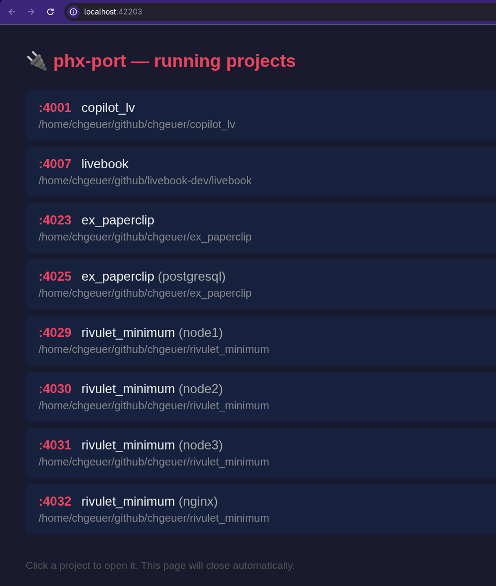
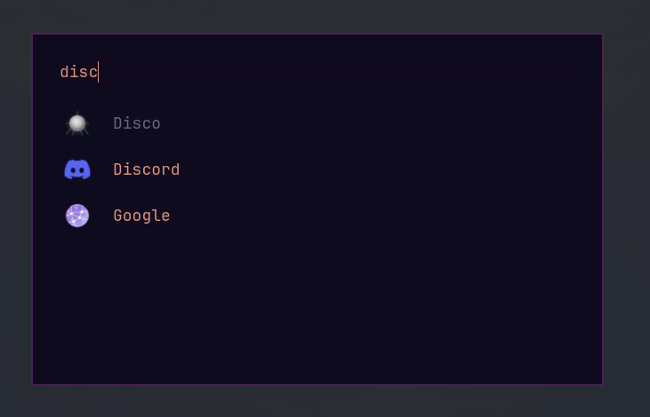

# phx-port

> Stop memorizing port numbers. One command, consistent ports for every project.

When you work on multiple web projects, they often default to the same port. `phx-port` gives each project its own stable port — automatically — so you never have collisions and never have to remember which port goes where. While originally built for [Phoenix](https://www.phoenixframework.org/), it works with any application that accepts a port via environment variable.

```bash
~/projects/my_app $ PORT=$(phx-port) iex -S mix phx.server
# → always starts on the same port, every time

~/github/livebook-dev/livebook $ LIVEBOOK_PORT=$( phx-port ) LIVEBOOK_IFRAME_PORT=$( phx-port iframe ) iex -S mix phx.server
# → The 2 ports necessary to run liveview.dev locally

~/projects/node_api $ PORT=$(phx-port) node server.js
# → works with any framework or language
```

## Install

```bash
cargo install --git https://github.com/chgeuer/phx-port
```

Or build from source:

```bash
git clone https://github.com/chgeuer/phx-port
cd phx-port
cargo build --release
cp target/release/phx-port ~/.local/bin/
```

## How it works

`phx-port` maintains a simple TOML registry at `~/.config/phx-ports.toml`.

Each project directory can have multiple named port roles (default: `main`):

```toml
[ports."/home/user/projects/my_app"]
main = 4001
debug = 4005

[ports."/home/user/projects/api_gateway"]
main = 4002

[ports."/home/user/projects/admin_dashboard"]
main = 4003
metrics = 4004
```

- **First run in a project** → allocates the next available port (starting at 4001, reusing gaps), saves it, and prints it
- **Subsequent runs** → prints the saved port instantly
- **Port 4000 stays free** for ad-hoc or unmanaged projects

Override the config location with the `PHX_PORT_CONFIG` environment variable:

```bash
export PHX_PORT_CONFIG="$HOME/.phx-ports.toml"       # Linux/macOS alternative
export PHX_PORT_CONFIG="C:\Users\me\.phx-ports.toml"  # Windows
```

Production workload automation can replace the current-directory key with an
explicit logical Workload ID:

```bash
export PHX_PORT_CONFIG=/var/lib/phx-port/ports.toml
export PHX_PORT_WORKLOAD_ID=contoso-web

PORT="$(phx-port)" HTTPS_PORT="$(phx-port https)" exec application-server

# Equivalent explicit CLI identity; the CLI value overrides the environment.
phx-port --workload-id contoso-web https
```

Logical IDs contain 1-128 lowercase ASCII characters, start and end with a
letter or digit, and may contain `.`, `_`, and `-`. Use a separate logical
registry rather than mixing production IDs with development paths. Logical
roles follow the same lowercase ASCII character set and are limited to 128
characters. The registry's parent directory must be owned by the effective
user with mode `0700`; the registry and sibling lock are regular, single-link
files with mode `0600`. Allocation uses the same exclusive lock and atomic
replacement as development, is idempotent under concurrent workload starts,
and does not contact a running ingress process. `PHX_PORT_WORKLOAD_ID` selects
only allocator identity; it does not activate public ingress.

## Usage

### In scripts and shell wrappers (piped mode)

When stdout is not a terminal, `phx-port` prints just the port number — perfect for command substitution:

```bash
# Default (main) port
PORT=$(phx-port) iex -S mix phx.server
PORT=$(phx-port) mix phx.server

# Named port roles — for debug, metrics, or any purpose
PORT=$(phx-port) PORT_DEBUG=$(phx-port debug) iex -S mix phx.server
PORT=$(phx-port) PORT_METRICS=$(phx-port metrics) node server.js
```

Put this in a project's `run` script and never think about ports again.

### Discovering running projects

```bash
# Show which registered projects are currently running (checks actual TCP connectivity)
phx-port running

# Open a browser page listing running projects — click one to open it
phx-port discover
```

`phx-port running` probes each registered port to check whether something is actually listening, and shows only the ones that are up:

```
$ phx-port running
  http://localhost:4001   /home/user/projects/api
  http://localhost:4003   /home/user/projects/shop
  http://localhost:4004   /home/user/projects/shop (debug)
```

`phx-port discover` starts a temporary local web server on a random free port and opens your default browser with a page listing all running projects. Each project shows its assigned localhost endpoint and any certificate-verified HTTPS hostnames discovered by the TLS daemon:

<p align="center">
  
</p>

The list is rebuilt on every page load, so projects that start or stop between refreshes are always reflected. Links point directly to the target app (for example, `http://localhost:4001` and `https://www.contoso.com/`) — no redirect is involved. HTTPS links appear only when a persisted, certificate-verified route matches that live project's exact role. When you click a link, the browser navigates there naturally while a background `sendBeacon('/shutdown')` call tells the discover server to exit.

On [Omarchy](https://omarchy.com), `phx-port discover` is registered as a desktop application called **Disco**, so you can launch it directly from the app launcher (<kbd>Super</kbd>+<kbd>Space</kbd>):

<p align="center">
  
</p>

### TLS/SNI proxy

The experimental daemon routes TLS connections to live registered workloads
without terminating TLS or reading their private keys:

```bash
# Workload
HTTPS_PORT="$(phx-port https)" my-https-server

# Foreground proxy; repeat --listen for additional addresses
phx-port daemon --listen 0.0.0.0:443 --listen '[::]:443'
```

Development is the default Hosting Profile and retains dynamic certificate
discovery. Public mode is selected only by `--ingress-config PATH` or
`PHX_PORT_INGRESS_CONFIG`. Public configuration accepts from one through 1,000
exact Route Declarations:

```toml
[ingress]
mode = "public"
unknown_sni = "reject"
listen = ["0.0.0.0:443", "[::]:443"]

[ingress.metrics]
listen = "127.0.0.1:9464"

[ingress.hosts."www.contoso.com"]
workload = "contoso-web"
role = "https"
required = true
relay_idle_timeout_seconds = 1800

[ingress.hosts."api.contoso.com"]
workload = "contoso-api"
role = "https"
required = false
relay_idle_timeout_seconds = 0 # disable for an intentionally quiet long-lived protocol
```

`[ingress.metrics]` is optional and accepts one numeric loopback socket
address with a nonzero port. It serves only `GET /metrics`, limits request
headers to 1 KiB and the Prometheus body to 1 MiB, and provides no mutation
endpoint. A bind or setup failure emits a bounded
`event=metrics_listener result=unavailable` record without stopping the data
plane. Capacity, delivery, reload, registry, and aggregate route metrics use
fixed labels. Per-route metrics are emitted only for the at-most-1,000 Route
Declarations, never for dynamically supplied SNI or source addresses.

Temporary source diagnostics are a separate explicit opt-in:

```toml
[ingress.source_diagnostics]
sample_every = 100
expires_at_unix_seconds = 0 # replace with current Unix time plus at most 3600
```

The absolute expiry may be at most one hour in the future when loaded. While
active, every `sample_every`-th successfully normalized ClientHello may emit
at most one `event=source_diagnostic` per second containing its kernel peer IP
and normalized SNI. Expired settings are inert; normal events and metrics
contain no source address.

Public relay inactivity defaults to 1,800 seconds per Route Declaration.
`relay_idle_timeout_seconds` may extend that bidirectional inactivity window;
zero explicitly disables it for the declaration. Progress in either direction
resets the deadline. Development relays retain their existing unlimited idle
lifetime.

The public Hosting Profile keeps operator intent, stable assignments, derived
state, and runtime endpoints in separate ownership domains:

| Purpose | Default | Ownership and mode |
|---|---|---|
| Route Declarations and policy | `/etc/phx-port/ingress.toml` | root-owned regular file, not group/other writable |
| Stable Workload/role assignments | `/var/lib/phx-port/ports.toml` | service-owned `0600`; parent and sibling lock are private |
| Disposable verified-route state | `/var/lib/phx-port/routes.toml` | service-owned `0600`; separate private lock |
| Runtime endpoints | `/run/phx-port/` | service-owned, `phx-port-admin`-grouped `0750` root; `0700` handoff directory; `0750` control directory |

`PHX_PORT_CONFIG` explicitly overrides the public Port Registry; derived route
state remains the sibling `routes.toml`. `PHX_PORT_RUNTIME_DIR` explicitly
overrides the runtime root. Public overrides must be absolute. These variables
do not activate public mode by themselves, and development keeps its existing
per-user combined registry and runtime paths.

For ordinary unprivileged startup, ingress validates every component of a
non-loopback intent path and the intent file as root-owned and free of unsafe
links or write permissions before listener acquisition. An effective-user-
owned intent file is accepted only for an explicitly loopback-only public-
profile exercise. Stable and derived files and their locks require service
ownership, private modes, single-link regular files, bounded content, and no
symlinks. Runtime, handoff, and control directories receive the same no-
symlink ownership/mode checks.

Public ingress reads one validated Port Registry snapshot populated by
`PHX_PORT_WORKLOAD_ID`, rejects malformed assignments and ports shared by
different Workload/role keys, and resolves only each declaration's exact
assignment. Undeclared registry entries remain inactive and are reported only
as a bounded aggregate. Each route becomes active only after its registered
loopback listener presents a system-trusted certificate valid for the exact
declared hostname. Undeclared SNI never reads the dynamic route cache or probes
any registered Workload. A Workload that allocates and binds after ingress
starts is reconciled in the background and becomes active only after the same
reachability and certificate proof.

A compatible production Workload explicitly gives its PHXP adapter the same
logical ID as `PHX_PORT_WORKLOAD_ID` and the declared role, then listens at
`/run/phx-port/handoff/<sha256(workload-id NUL role)>.sock`. The daemon prefers
that original-descriptor PHXP handoff and falls back to encrypted loopback
relay only when handoff is unavailable before descriptor delivery.
`PHX_PORT_RUNTIME_DIR` overrides `/run/phx-port` for both peers in tests or
nonstandard deployments; it is required for a macOS production root because
macOS does not provide `/run`. `PHX_PORT_WORKLOAD_ID` alone remains only an
allocator identity and does not change development PHXP derivation or activate
public ingress. Ingress never creates, removes, or globally cleans
Workload-owned endpoints, so they survive ingress restart. The handoff
directory remains service-owned mode `0700`; same-UID peer authentication and
the irreversible post-delivery no-relay boundary are unchanged on Linux and
macOS.

Verified public routes are persisted only to disposable `routes.toml`, never to
the stable Port Registry, and are revalidated against the same declaration and
certificate before every process activates them. Corrupt disposable state is
discarded and rebuilt from declarations, registrations, and certificate
proofs.
The daemon reloads a structurally valid changed declaration snapshot as one
generation; an invalid reload keeps the preceding generation active, and a
late certificate result cannot cross generations. A missing required route
makes `ready=false`; an inactive optional route contributes degraded detail
without changing readiness. `proxy status` reports generation, declaration,
readiness, bounded registry/reload diagnostics, and distinct handoff,
fallback, and relay counters. This file split is not a production-readiness
claim; service activation, authorization, load qualification, and canary gates
remain separate milestones.

Validate the complete public file/runtime boundary, or split an existing
private logical registry that still contains `[discovered_routes]`:

```bash
PHX_PORT_CONFIG=/var/lib/phx-port/ports.toml \
  PHX_PORT_RUNTIME_DIR=/run/phx-port \
  phx-port proxy config check --file /etc/phx-port/ingress.toml

phx-port proxy config migrate \
  --from /var/lib/phx-port/combined.toml \
  --output /var/lib/phx-port/migrated
```

Migration publishes `ports.toml` and `routes.toml` together by atomic directory
rename, refuses an existing output path, and never changes the source file.
The retained source is the permission-preserving rollback snapshot. The split
`ports.toml` keeps the preceding logical-assignment schema, so the preceding
binary can use it directly if its `PHX_PORT_CONFIG` is pointed there. Back up
the root-owned ingress file and stable `ports.toml` with their ownership and
modes; do not back up disposable `routes.toml`, locks, or runtime sockets.

The Tokio ingress has explicit startup capacity options:

| Option | Default |
|---|---:|
| `--active-connections` | 256 |
| `--pre-routing-connections` | 128 |
| `--relay-connections` | 128 |
| `--handoff-negotiations` | 64 |
| `--accepts-per-second` | 200 |
| `--accept-burst` | 400 |
| `--source-accepts-per-second` | 20 |
| `--source-accept-burst` | 40 |
| `--source-pre-routing-connections` | 16 |
| `--source-ipv6-prefix` | 64 |
| `--source-table-capacity` | 4096 |
| `--source-entry-ttl-seconds` | 300 |
| `--client-hello-timeout-ms` | 2000 |

Before binding any listener, the daemon rejects zero values, sublimits above
the global connection limit, ClientHello timeouts outside 500-10000
milliseconds, arithmetic overflow, and active limits above the bounded 8,192
async state-machine ceiling. Relay connect and copy I/O run inside those
tracked Tokio tasks. PHXP remains on a transitional blocking handoff pool, so
startup also rejects configurations requiring more than 256 handoff workers;
raising active, pre-routing, or relay capacity does not raise that native-
thread ceiling. The daemon checks estimated descriptor demand against the
process `RLIMIT_NOFILE` while preserving a 30% reserve. If the process soft
limit is too low but its hard limit permits the configured capacity, startup
raises only the process soft limit to the calculated minimum and verifies the
result; the configured limits never change with the host environment.
Otherwise startup fails with the required and available values. On Linux it
also checks the systemd cgroup task ceiling and its existing occupants when
available; `--task-budget N` supplies an additional operator ceiling on any
platform.

The daemon enforces the global accept-rate/burst and active, pre-routing,
relay, handoff, and per-source ceilings at runtime. IPv4 peers use exact-address
buckets; IPv6 peers use the configured prefix. Source buckets default to 20
accepts per second with burst 40 and 16 simultaneous pre-routing connections.
The expiring source table retains at most 4096 entries and evicts the
least-recent idle entry when full; if every entry is active, a new source is
rejected. Source identity comes only from the accepted socket's kernel peer
address, never SNI, headers, or public protocol bytes.

Repeat
`--source-policy CIDR=RATE,BURST,PRE_ROUTING[,IPV6_PREFIX]` to give an
operator-declared network different finite limits. The longest matching CIDR
wins, duplicate normalized CIDRs are rejected, and at most 256 overrides are
accepted. An optional fourth field changes IPv6 bucketing inside that CIDR and
must be at least as specific as the CIDR itself.

The daemon acquires active, source, and pre-routing permits immediately after
Tokio accepts a socket and before creating its tracked connection task. Tokio
peeks at a ClientHello without consuming it, using one total deadline and a
buffer that grows from 4 KiB to the fixed 64 KiB ceiling. Cache-miss route
selection crosses a fixed eight-worker blocking boundary with a 56-entry queue
and a 250-millisecond total queue-and-selection deadline. A successfully
verified route enters the one-slot bounded handoff queue. The PHXP result
returns to the same tracked Tokio task before fallback relay begins;
saturation at either queue closes the new socket and releases its RAII
permits. Shutdown cancels and drains Tokio-owned routing and relay work before
the blocking handoff pool drain begins.

Handoff negotiation uses its own permit; relay capacity is reserved before
opening a backend socket, then source and pre-routing capacity are released
while the active and relay permits remain held until encrypted copying ends.
Each relay uses two fixed 16 KiB copy buffers, forwards the still-unconsumed
ClientHello exactly once, propagates TCP half-close in both directions, and
records fixed-label directional byte totals, aggregate duration, idle timeout,
and backend-connect failure counters.
`proxy status` reports both queue bounds, aggregate source-table use,
configured limits, and bounded rejection-reason counters without
source-address labels. Saturation also emits a fixed-schema
`event=ingress_overload` stderr record at most once per bounded reason every
ten seconds. Further rejections in that window are suppressed and aggregated
into the next event; neither source addresses nor SNI values appear in the
event. Production load qualification and async PHXP remain separate
milestones; the bounded async relay path is not a public-load support claim.

For an unknown SNI hostname, `phx-port` probes active `https` and `main`
workloads over loopback using that exact hostname. It routes only when exactly
one backend completes a system-trusted, hostname-valid TLS handshake. The
original ClientHello is then relayed unchanged, so the backend remains the TLS
endpoint and retains its own certificate and private key.

Successful development discoveries remain cached in the per-user registry.
Public verified-route state is stored only in the separate disposable
`routes.toml`. Both can be inspected alongside live daemon health:

```bash
phx-port proxy status
phx-port proxy status --json
phx-port proxy check --live
phx-port proxy check --ready
phx-port proxy routes
sudo --preserve-env=PHX_PORT_INGRESS_CONFIG,PHX_PORT_CONFIG,PHX_PORT_RUNTIME_DIR \
  phx-port proxy reload
phx-port proxy stop
phx-port proxy install-service
phx-port proxy uninstall-service
```

`status --json` emits schema version 1 with liveness, readiness, generation,
bounded degraded Route Declaration detail, capacity use, and counters.
`check --live` and `check --ready` emit the same bounded JSON; exit status 0
means the requested condition is true, while status 1 means it is false or the
authenticated local endpoint cannot be queried.

`proxy routes` uses the daemon's live route table when it is running and falls
back to persisted routes otherwise. Development keeps its current-user control
socket at `$XDG_RUNTIME_DIR/phx-port/control.sock`, or under the configuration
directory when `XDG_RUNTIME_DIR` is unavailable. Public mode uses
`$PHX_PORT_RUNTIME_DIR/control/control.sock`, defaulting to
`/run/phx-port/control/control.sock`; public CLI queries must receive the same
`PHX_PORT_INGRESS_CONFIG`, `PHX_PORT_CONFIG`, and `PHX_PORT_RUNTIME_DIR`
selection as the daemon.

Every accepted control connection is authenticated from kernel peer
credentials. The development socket remains owner-only mode `0600`, and that
current user retains full authority for commands applicable to the development
Hosting Profile. The public
socket is service-owned, grouped like the `0750` runtime root, and mode `0660`;
the runtime group must be `phx-port-admin`. UID 0, the service UID, and current
members of `phx-port-admin` may read status, routes, and health. Only UID 0 may
issue `RELOAD` or `STOP` in the public Hosting Profile.

On Linux, `install-service` writes
`$XDG_CONFIG_HOME/systemd/user/phx-port.service` (or
`~/.config/systemd/user/phx-port.service`), records absolute executable and
registry paths, reloads the user manager, and enables and starts the service.
This remains a development-profile user service that binds listeners directly;
it does not activate production or replace a machine service. The unit runs the
daemon in the foreground with `Restart=on-failure`, `LimitNOFILE=65536`,
`TasksMax=1024`, and the existing 35-second service-manager stop deadline.
`uninstall-service` disables and stops the service before removing the unit.

For deliberate foreground use from a root shell, `--run-as USER` is the only
supported privileged daemon path:

```bash
sudo phx-port daemon --run-as phx-port \
  --ingress-config /etc/phx-port/ingress.toml \
  --listen 0.0.0.0:443 --listen '[::]:443'
```

Every listener must be explicit and must exactly match the public config's
`[ingress] listen` array. The daemon resolves the target account and
supplementary groups, binds only those listeners, permanently sets the target
groups, GID, and UID, verifies that UID 0 cannot be regained, and enables Linux
`no_new_privs`. Only then does it read ingress intent, initialize state/runtime
paths, install signal handling, or start workers. A root-started daemon without
`--run-as`, a root target, and `--run-as` from an unprivileged process are
rejected. Other root CLI commands retain their existing behavior.

The explicit public Hosting Profile ships separate system units in
`packaging/systemd/` and in the Linux release archive's `systemd/` directory.
Provision the non-login `phx-port` user and group plus a `phx-port-admin`
group, add the service account and read-only operators to that administration
group, install the binary at `/usr/local/bin/phx-port`, install the root-owned
ingress intent, then install and start all three units:

```bash
sudo install -o root -g root -m 0755 target/release/phx-port \
  /usr/local/bin/phx-port
sudo install -d -o root -g phx-port -m 0755 /etc/phx-port
sudo install -o root -g phx-port -m 0640 ingress.toml \
  /etc/phx-port/ingress.toml
sudo install -o root -g root -m 0644 packaging/systemd/phx-port.service \
  packaging/systemd/phx-port-ipv4.socket \
  packaging/systemd/phx-port-ipv6.socket /etc/systemd/system/
sudo systemctl daemon-reload
sudo systemctl enable --now phx-port-ipv4.socket phx-port-ipv6.socket \
  phx-port.service
```

The service unit initializes the service account's `phx-port-admin`
supplementary membership and groups the runtime root for authenticated
read-only control access. The IPv4 and IPv6 socket units own port 443 and pass descriptors named
`tls-ipv4` and `tls-ipv6`. The unprivileged service accepts only the exact
configured listening TCP sockets, sets them nonblocking and close-on-exec, and
does not bind again. systemd creates private state/runtime roots; the service
creates the mode `0700` handoff directory without removing Workload endpoints
on restart. Its sandbox has no capabilities, restricts address families and
writable paths, uses `LimitNOFILE=65536`, `TasksMax=1024`, a finite
`MemoryMax=70%` ceiling, and allows five seconds beyond the public profile's
60-second drain. Tune the memory ceiling downward for the measured host and
Workload budget; it is a resource boundary, not a capacity claim. Development
retains its existing 30-second daemon drain.

The real system-manager regression uses an isolated loopback socket and
temporary unit names so it does not disturb port 443:

```bash
cargo test --test systemd_socket_activation \
  real_systemd_unit_routes_writes_state_and_restarts_rootlessly \
  -- --ignored --exact
```

It requires a Linux system manager and noninteractive `sudo`; it proves
certificate-verified routing, derived-state writes, local control, sandboxed
non-root identity with no effective capabilities, and routing after restart.

On macOS, the public Hosting Profile ships
`packaging/launchd/dev.phx-port.ingress.plist`, also included under `launchd/`
in macOS release archives. Provision the non-login `phx-port` account and
`phx-port-admin` group, add the service account and read-only operators to that
group, then provision its root-owned intent plus service-owned state/runtime
directories and install the LaunchDaemon:

```bash
sudo install -d -o root -g phx-port -m 0755 \
  "/Library/Application Support/phx-port"
sudo install -d -o phx-port -g phx-port -m 0700 \
  "/Library/Application Support/phx-port/state"
sudo install -d -o phx-port -g phx-port-admin -m 0750 \
  /private/var/run/phx-port
sudo install -d -o phx-port -g phx-port -m 0700 \
  /private/var/run/phx-port/handoff
sudo install -o root -g phx-port -m 0640 ingress.toml \
  "/Library/Application Support/phx-port/ingress.toml"
sudo install -o root -g wheel -m 0644 \
  packaging/launchd/dev.phx-port.ingress.plist /Library/LaunchDaemons/
sudo launchctl bootstrap system \
  /Library/LaunchDaemons/dev.phx-port.ingress.plist
```

The plist's `tls-ipv4` and `tls-ipv6` sockets own port 443. The non-root daemon
retrieves them by name with `launch_activate_socket()`, requires exactly one
listening TCP descriptor on each configured address, and sets both
nonblocking and close-on-exec without rebinding. Adjust the account and paths
in the plist only together with the provisioned ownership. Remove it with
`sudo launchctl bootout system/dev.phx-port.ingress` before deleting the
plist. The ignored `real_launchd_job_adopts_named_socket_and_runs_as_owner`
test exercises the same API in a disposable user launchd domain without
touching port 443.

The daemon revalidates a persisted mapping before activating it in a new
process. Newly active `https` workloads that present a no-SNI default
certificate are also discovered eagerly from their exact DNS SANs; strictly
SNI-only workloads and HTTPS servers using the compatibility `main` role
continue to use lazy discovery. This avoids sending speculative TLS handshakes
to ordinary clear-HTTP `main` listeners.

On Linux and macOS, the daemon also checks the route's derived PHXP endpoint
for a version-compatible, same-user socket-handoff receiver. When present, it
passes the untouched client descriptor with `SCM_RIGHTS`; otherwise it uses
the ordinary relay:

| Platform | Control transport | Peer authentication | Default endpoint root |
|---|---|---|---|
| Linux | `AF_UNIX/SOCK_SEQPACKET` | `SO_PEERCRED` | `$XDG_RUNTIME_DIR/phx-port/handoff` |
| macOS | `AF_UNIX/SOCK_STREAM` with PHXP length framing | `getpeereid` | `/tmp/phx-port-<euid>/handoff` |

Set `PHX_PORT_RUNTIME_DIR` to use an explicit runtime root on either platform;
the endpoint is then `<runtime>/handoff/<hash>.sock`. The repository includes
a reusable Phoenix/Bandit integration and minimal Elixir and Rust reference
servers for Linux and macOS. The .NET 10 receiver remains Linux-only:

- [`integrations/elixir/phx_port_handoff`](integrations/elixir/phx_port_handoff)
- [`samples/elixir`](samples/elixir)
- [`samples/rust`](samples/rust)
- [`samples/dotnet`](samples/dotnet)

The handoff design and protocol are described in
[`docs/tls-proxy-design.md`](docs/tls-proxy-design.md) and
[`docs/socket-forwarding-design.md`](docs/socket-forwarding-design.md), with
the Darwin transport profile in
[`docs/macos-socket-handoff-design.md`](docs/macos-socket-handoff-design.md).

### macOS handoff playground

The repository includes a local playground for the Darwin handoff path. It
uses these trusted certificates directly, without copying them into the
repository:

```text
~/.dns/production/a.pollmann.rocks.{crt,key}
~/.dns/production/b.pollmann.rocks.{crt,key}
~/.dns/production/c.pollmann.rocks.{crt,key}
```

Start the Phoenix/Bandit handoff sample, the Rust/Axum handoff sample, a
relay-only OpenSSL backend, and the proxy:

```bash
just play-up
just play-status
just play-try
just play-logs daemon
just play-down
```

The proxy listens on `0.0.0.0:443` and `[::]:443`; all backend listeners stay
on loopback. `a.pollmann.rocks` uses Phoenix/Bandit handoff,
`b.pollmann.rocks` uses Rust/Axum handoff, and `c.pollmann.rocks` deliberately
has no handoff receiver so it exercises TLS relay fallback. `just play`
combines startup and the request suite.

The targets invoke the locally built `phx-port` CLI to register stable
`main`/`https` roles for `samples/elixir` and `samples/rust`, and an `https`
role for `samples/relay`. These are normal project registrations, visible in
`phx-port list`, and use `~/.config/phx-ports.toml` unless
`PHX_PORT_CONFIG` overrides it. `just play-down` stops the processes but keeps
the stable registrations.

External clients must resolve each hostname to this Mac's reachable address,
not `127.0.0.1`, and the macOS firewall and any intervening router must allow
TCP port 443. For a one-off client-side test without changing DNS:

```bash
curl --resolve a.pollmann.rocks:443:192.0.2.10 \
  https://a.pollmann.rocks/
```

Replace `192.0.2.10` with this Mac's LAN or public address. Playground logs and
PID files stay below `/tmp/phx-port-play-<uid>`; private keys remain in
`~/.dns/production`.

If those DNS names resolve to `127.0.0.1` on another machine, forward that
machine's loopback port to the Mac instead:

```bash
sudo ssh -N -o ExitOnForwardFailure=yes \
  -L 127.0.0.1:443:127.0.0.1:443 chgeuer@mini.geuer-pollmann.de
```

With that tunnel running, `curl https://a.pollmann.rocks`,
`curl https://b.pollmann.rocks`, and `curl https://c.pollmann.rocks` use the
standard HTTPS port and retain normal hostname and certificate verification.

### Managing registrations

```bash
# Show ports as a directory tree with clickable URLs (default)
phx-port list

# Flat list of all registered projects and their ports
phx-port list --flat

# Tree view with port numbers instead of URLs
phx-port list --port-only

# Explicitly register the current directory (default role: main)
phx-port register

# Register a named port role
phx-port register debug

# Remove all ports for a project — by port number, directory name, or current directory
phx-port delete 4003
phx-port delete admin_dashboard
phx-port delete .

# Remove a specific port role
phx-port delete . debug
phx-port delete admin_dashboard metrics

# Open the default browser for the current directory's port
phx-port open

# Open the browser for a named port role
phx-port open debug

# 'launch' is an alias for 'open'
phx-port launch
phx-port launch debug
```

### Interactive mode

Running `phx-port` with no arguments in a terminal shows the help text. This way it never accidentally auto-registers when you're just exploring.

## Example workflow

```
~/projects/shop $ phx-port list --flat
 4001  /home/user/projects/api
 4002  /home/user/projects/admin

~/projects/shop $ PORT=$(phx-port) iex -S mix phx.server
Registered /home/user/projects/shop → port 4003    # ← stderr, first time only
[info] Running ShopWeb.Endpoint on http://localhost:4003

~/projects/shop $ PORT=$(phx-port) PORT_DEBUG=$(phx-port debug) iex -S mix phx.server
Registered /home/user/projects/shop (debug) → port 4004    # ← new role
[info] Running ShopWeb.Endpoint on http://localhost:4003

~/projects/shop $ phx-port list --flat
 4001  /home/user/projects/api
 4002  /home/user/projects/admin
 4003  /home/user/projects/shop
 4004  /home/user/projects/shop (debug)
```

### Tree view

With many projects, the tree view (the default) gives a cleaner overview grouped by directory structure. Single-child directories are collapsed automatically, and ports are shown as clickable URLs:

```
$ phx-port list
/home/user
├── projects
│   ├── api ......... http://localhost:4001
│   ├── admin ....... http://localhost:4002
│   └── shop ........ http://localhost:4003, http://localhost:4004 (debug)
└── work/services ... http://localhost:4005
```

Add `--port-only` to show just port numbers instead of URLs:

```
$ phx-port list --port-only
/home/user
├── projects
│   ├── api ......... 4001
│   └── shop ........ 4003, 4004 (debug)
└── work/services ... 4005
```

## VS Code extension

A bundled [VS Code extension](vscode-extension/) adds two commands to the Explorer folder context menu:

- **Open in Browser (phx-port)** — looks up the port for the selected folder and opens `http://localhost:<port>` in your default browser.
- **Show Port (phx-port)** — displays the assigned port number in a notification.

### Install from source

```bash
just vscode-install    # compiles, packages, and installs the .vsix
```

Or manually:

```bash
cd vscode-extension
npm install
npm run compile
npx @vscode/vsce package --no-dependencies
code --install-extension phx-port-*.vsix
```

To uninstall:

```bash
just vscode-uninstall
```

## License

MIT
