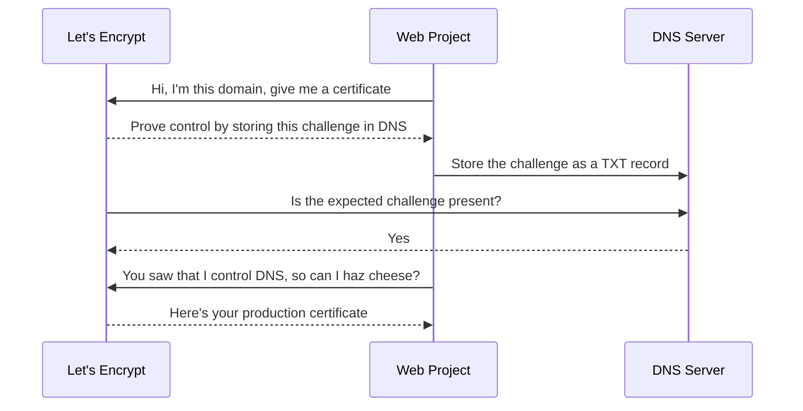
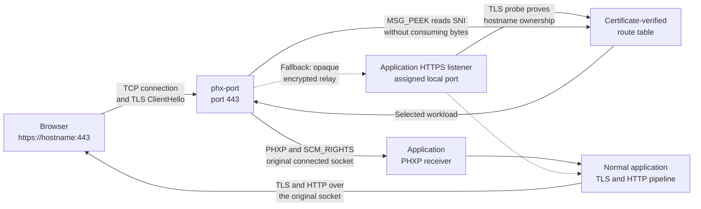

# Blog

In this article I describe what my `phx-port` utility can do. It allows you to easily connect to all your locally running web projects (without having to remember TCP port numbers), but also experience *real* TLS access with proper domain names, all over port 443, without having to give it the keys to the kingdom.

## Managing port numbers

I was running multiple web projects on my machine, and each HTTP endpoint needed its own TCP port to listen on. Elixir Phoenix by default uses port 4000. Of course it's extensible and configurable, and if you meticulously remember to set the `PORT` environment variable to an unused port number before launching Phoenix, it's all great. But LLMs made my brain and memory rot, and I can't (or don't want to) remember all that ceremony. So instead of `PORT=4010 mix phx.server`, I just wanted to say `PORT="$(gimme some free port)" mix phx.server`, and some tool should figure it out.

That was the initial idea behind `phx-port`. When it is called in a shell script like `PORT="$(phx-port)"`, the utility looks up the current directory (treating the path as a synonym for the web app), consults its own growing config file, and says: "Let's give `/home/chgeuer/src/webapp1` port 4012 from now on", so whenever we run `phx-port` in that directory, it returns 4012.

## It's not Elixir-specific

Even though I called it **phx**-port (like in Elixir's Phoenix web framework), the utility is built in Rust, and doesn't care which application it's giving port numbers for. It just remembers directory-to-port numbers.

## Managing (multiple) port numbers

Often, projects need multiple ports, like one for the HTTP listener, one for the HTTPS/TLS listener, maybe one for a relational database or something else. So you can define aliases for which you want a port number, like `PORT="$(phx-port)" TLS_PORT="$(phx-port https)" DB_PORT="$(phx-port sql)" ./run-my-servers.sh`. In that case, plain `phx-port` gives the port of the `main` alias, but there are also ports for `https` and `sql`.

So in my `~/.config/phx-ports.toml` file, I see something like this:

```toml
[ports]

[ports."/home/chgeuer/src/webapp1"]
main = 4012
https = 4013
sql = 4014
```

In order to get a nice overview, running `phx-port list --port-only` shows me

```
/home/chgeuer
├── src
│   ├── webapp1 ....... 4012, 4013 (https), 4014 (sql)
```

So I can easily see which projects are on which ports. And of course, I can fiddle in the config text file, or run `phx-port register` or  `phx-port delete` for CRUD-like operations.

## Discovery - via CLI, Code or browser

I also wanted a convenient way to open the corresponding web pages (because, you know, my brain doesn't remember port numbers any more).

### Opening via CLI

In a web project, I can simply run `phx-port open` and it launches the system's default browser against the right port:

```text
webapp1$ phx-port open
Opening http://localhost:4012
Opening in existing browser session.

webapp1$ 
```

### If you still use the mouse - open via Visual Studio Code

You can also install a little VS Code plugin so you can right-click your project directory in Explorer, and select the "Open in Browser (phx-port)" entry to achieve the same thing.

### One web page to rule them all

However, the best thing is to run `phx-port discover`, which has phx-port spin up a little web server and display a page with all running projects and clickable links to their ports. When you follow one of those links, the page notifies the built-in server in the background and the `phx-port` process terminates, so the discovery server doesn't hang around any longer than it needs to.


On my machine, I just run the little [`omarchy-setup.sh`](../omarchy-setup.sh) script to register a keyboard shortcut to quickly bring me to the discovery page. Wham-bang, quick and easy.

## A side quest: TLS and secure all the things

So now that all gives me a slick local dev experience, I can have many web projects and hobby stuff running on my machine, each one with its own ports, listening on localhost, discover them, cool. But - I'm also a developer who wants to fully enable security-related stuff as early as possible in a project lifecycle. That is, I want to enable HTTPS (TLS) as soon as possible.

### Let's Encrypt over HTTP-01

**`site_encrypt`**: In the Elixir ecosystem, the wonderful Saša Jurić created a library project called [`site_encrypt`](https://github.com/sasa1977/site_encrypt); you can install that library in your public Internet-facing web project, and `site_encrypt` reaches out to the Let's Encrypt certificate authority and runs the ACME HTTP-01 challenge. As you probably know, Let's Encrypt is a CA that issues "free" X.509 certificates which you can use for enabling TLS on a web server with a publicly trusted certificate. It's a great project and solution, but I can't use it as-is: The HTTP-01 challenge means that when your web server tries to convince Let's Encrypt that it controls a domain name, Let's Encrypt essentially says: "Place this little secret at a specific HTTP URL under that domain. We'll try to download it in a few seconds, and if we can, we believe you control the domain and we're willing to issue you the certificate."

That's a bummer, because during development I'm running stuff on my developer laptop, which is in my home LAN, behind a DSL router and NAT, and Let's Encrypt cannot reach any of my web projects from the public Internet. Luckily, Let's Encrypt also offers another way to prove that I control a domain (so they're willing to issue me a certificate), the ACME DNS-01 challenge.



So I created a little `:acme_dns` library, which supports DNSimple and Azure DNS as DNS providers, and which then handles dynamic certificate issuance for my web projects. DNS-01 does not require Let's Encrypt to reach the laptop at all; it proves control by asking me to publish a temporary DNS TXT record. Separately, I arrange for the hostname to resolve to my laptop from the clients that should reach it, for example through local DNS, a private LAN address, or a public address with suitable routing. The web app can then grab a real, publicly trusted certificate from Let's Encrypt, and I can reach my project via HTTPS.

### `localhost` and some funky port don't cut it anymore

So let's say for the sake of the argument I have my web project `/home/chgeuer/src/webapp1` host the TLS endpoint **with a production-grade TLS cert** on `https://localhost:4013/`. When I visit that page with the web browser, I have a set of problems, all related to the domain name.

> Excursion -- Understanding SNI (Server Name Indication): In the dark ages of SSL and early TLS, a server normally had to choose its certificate before it could see the HTTP `Host:` header. That made name-based HTTPS hosting awkward: You could point many hostnames at one IP address, but unless one certificate covered all of them, the server did not know which certificate to present. The Server Name Indication (SNI) extension fixes that. During the TLS handshake, the client tells the server which hostname it wants, so a server hosting multiple domains on one IP address and port can pick and present the right X.509 certificate.

So when a web browser establishes a normal TLS connection to a web server, it communicates via SNI which domain it wants to talk to, waits for the server's certificate, and ensures that the certificate is valid for the visited domain. So coming back to our TLS endpoint on `https://localhost:4013/`, we now have a problem: Our web server does not have a certificate for `localhost`; it only has one for our configured domain. Modern certificates list their valid hostnames as **Subject Alternative Names** (SANs). If the certificate has a SAN for `www.geuer-pollmann.de`, but the browser visited `localhost`, the names do not match and the browser raises a security warning.

But - we can manually change the browser address and visit `https://www.geuer-pollmann.de:4013/`. If DNS for `www.geuer-pollmann.de` points to an IP address on which our web server is reachable, then we see our web workload without security warnings. The last issue we have is that nasty port number: Slapping that `:4013` into the address bar sucks, it annoys my eyes, and it gives us a different web origin from the ordinary port-443 site. Ports above 1024 are not inherently untrusted or fishy; this one is simply non-standard, ugly, and another detail I don't want to remember.

## Would the real hostname please stand up?

So by now we have two problems: `phx-port discover` shows `https://localhost:xxxx/` links, so `localhost` and the stupid ugly port number. But - we can get creative. `phx-port` already knows the ports it assigned, so it can check which registered `https` ports are actually listening and perform a proper TLS probe. When a workload presents a default certificate without first requiring SNI, `phx-port` can eagerly learn the exact DNS names from its SANs. For servers that choose a certificate only after seeing SNI, an incoming hostname can trigger a bounded lazy probe instead. In either case, a route is accepted only when the backend completes a valid TLS handshake for that exact hostname.

So `phx-port` can learn that the workload behind `https://localhost:4013/` is entitled to serve `https://www.geuer-pollmann.de:4013/`, persist that as derived information, and show the real hostname in the discovery page. When we follow one of those links, we immediately get to the TLS endpoint with the appropriate certificate.

The only problem left is the non-standard port.

## Let's turn `phx-port` into a reverse proxy

Then we (my coding agent and I) got creative: Instead of using `phx-port` as a glorified database for free port numbers and a temporary web server for a navigation page, we extended it to be a proper reverse proxy. A "reverse proxy" here means a component that listens on the standard TLS/HTTPS port 443, accepts incoming connections, and routes them to the workload in the back. So when I connect to `https://www.geuer-pollmann.de/` (implicitly that's `https://www.geuer-pollmann.de:443/`), we want to take that connection and deliver it to the backend web server, in this case our workload listening on TCP port 4013.

### Who owns the private key?

However, there's a new problem: A conventional HTTP reverse-proxy setup *terminates* the incoming TLS connection. "TLS termination" means that the reverse proxy (like Nginx) has access to the web server's TLS certificate and private key, acts as the TLS endpoint towards the browser, decrypts the request, establishes a new connection to the downstream web server (`https://localhost:4013` in our case), and forwards requests and responses between the two. That's a perfectly normal architecture, but it violates a few constraints I care about:

- I don't like giving the reverse proxy the private keys. Ideally TLS should only be configured in my web workload (my `/home/chgeuer/src/webapp1` project). I don't want to have a proliferation of key material here.
- The web workload doesn't see the client IP address: From my web project's perspective, the incoming TCP/TLS connection comes from the reverse proxy, not the user's web browser. A correctly configured HTTP proxy can solve that by replacing and injecting trusted headers such as `Forwarded` or `X-Forwarded-For`, but that requires terminating TLS and understanding HTTP. Our layer-4 TLS router deliberately does neither.
- Security boundary: I want the web application itself to remain the TLS endpoint and the only process holding its private key. A well-operated terminating proxy can be secure, but it creates another trusted place where plaintext and key material exist, and I don't want that.
- Cryptographic performance: Decrypting the incoming TLS connection, just to establish another TLS connection to the origin server on port 4013, adds cryptographic and connection-management work, even though we're not doing any useful HTTP processing in the middle.

### Peeking into ClientHello

So all that sucks, so what can we do instead? When there's an incoming TCP/TLS connection to `phx-port`, the proxy **peeks** at the incoming network stream. Like Al Pacino said in "The Devil's Advocate": **Look, but don't touch. Touch, but don't taste. Taste, don't swallow.** We don't want to swallow bytes from the incoming network stream, we just want to look. We just look enough to see the web browser's TLS stack's ClientHello message in which the browser tells us which domain it wants to talk to. 


> There is a newer TLS feature called Encrypted Client Hello (ECH), whose configuration is commonly advertised through HTTPS/SVCB DNS records. ECH can hide the real hostname inside an encrypted ClientHello. If a client uses ECH for one of our domains, `phx-port` cannot dynamically route on a hostname it cannot see, so those domains must not enable ECH for this setup.

So now `phx-port` can 'see' for which web domain the request came in on standard port `:443`. In the background, the service maintains its certificate-verified routes and can perform a bounded probe of registered HTTPS workloads when it sees an unknown hostname. Once it has matched the ClientHello's SNI name to the one workload that can present a valid certificate for it, `phx-port` can relay the **encrypted** byte stream to that backend service.

What do we get from that? We solve a few of the previously mentioned problems: 

- Our `phx-port` service does not need access to the web app's private keys; it figures out from ClientHello which destination to route to, but doesn't have to decrypt, so there is no need for the private key.
- Because we don't decrypt the session, well, we don't decrypt the session. Which is good both for security (no plaintext to protect) and performance (no decryption and re-encryption).

By now we have a reverse proxy which can take incoming TLS connections on standard port 443 and route them to the correct web app on our laptop. By the way, that web app doesn't have to listen on the laptop's public IP. It is sufficient to listen on localhost/127.0.0.1, so there is no direct exposure of the backend port to the outside world.

## Solving the last issues: network performance and IP address visibility

By now, our `phx-port` reverse proxy relays encrypted TCP connections, i.e. it accepts the incoming TCP connection, establishes a second TCP connection to the web workload, and forwards the encrypted byte stream in both directions. Therefore, we still have two problems remaining: Every connection needs another socket, another TCP handshake, buffers, scheduling, two copy loops, and a proxy process that must remain alive until the client disconnects. That may not be catastrophically slow over loopback, but it is work the architecture doesn't actually need. And - our web workload still cannot see the real client's IP address, because its TCP peer is `phx-port` running on localhost.

Then I remembered an interesting [conversation on Twitter](https://x.com/chris_mccord/status/2029630330630508929) with Elixir Phoenix inventor Chris McCord, about the possibility of using `SCM_RIGHTS` on Unix-like systems to hand an existing, established TCP socket to a completely different OS process. Back then I did a few experiments in https://github.com/chgeuer/blue_green where that mechanism could be used to do blue/green deployments, or hand an established connection from an Erlang process to a Rust process.

Strictly speaking, `SCM_RIGHTS` does not teleport or atomically move a socket. It gives the receiving process another file descriptor referring to the same kernel socket. Once the receiver has safely adopted it, `phx-port` closes its own descriptor without calling `shutdown()`, leaving the application as the sole owner.

There is one important boundary here: This magic only works between processes on the **same computer**. A file descriptor is a handle into one operating-system kernel, and `SCM_RIGHTS` can pass that handle only over a local Unix-domain socket to another process using that same kernel. It cannot send an established TCP socket across the network to another machine. A distributed load balancer can tunnel packets or proxy a connection to another host, but that is a different architecture and puts something back into the data path.

Which made me think: that's exactly what I have now - a Rust process (`phx-port`) that owns an incoming TCP/TLS connection and would like a downstream service, such as a Phoenix web app, to actually own and control the established socket. A while back, the Phoenix ecosystem gained a new underlying web stack, namely [Matt Trudel's](https://github.com/mtrudel) [Thousand Island](https://github.com/mtrudel/thousand_island) and [Bandit](https://github.com/mtrudel/bandit).

My web app already uses Thousand Island (which owns the TCP socket listener), and Bandit (which routes the HTTP request towards Plug and Phoenix). So I was wondering: Can the Phoenix web app do both—listen on the TLS port, e.g. `:4013`, for ordinary incoming TCP/TLS connections, but *also* allow an external process like `phx-port` to hand over established sockets?

That is what the [`phx_port_handoff` Elixir module](https://github.com/chgeuer/phx-port/tree/master/phx_port_handoff) in our project does. In addition to the regular `MyAppWeb.Endpoint`, we have an additional supervised `PhxPortHandoff` child that accepts established sockets handed over from `phx-port` and feeds them into the regular Bandit/Phoenix request-handling pipeline:

```elixir
def start(_type, _args) do
  project = File.cwd!()
  https = Application.fetch_env!(:my_app, MyAppWeb.Endpoint)[:https]

  children = [
    PhxPortHandoff.bandit_child_spec(MyAppWeb.Endpoint, project, "https", https),
    MyAppWeb.Endpoint
  ]

  Supervisor.start_link(children,
    strategy: :one_for_one,
    name: MyApp.Supervisor
  )
end
```

### This is not just a Phoenix trick

Phoenix and Bandit were where I first proved the idea, but PHXP—the small protocol `phx-port` uses for the handoff—is not tied to Elixir or the BEAM. The repository contains working samples for [Rust with Axum](../samples/rust), [Node.js with Fastify](../samples/node), [.NET with Kestrel](../samples/dotnet), and [Python with FastAPI/Uvicorn](../samples/python). There are also samples for [Go's `net/http`](../samples/go) and, of course, [Elixir with Bandit](../samples/elixir).

Each adapter does only the narrow bit of plumbing its runtime needs: receive and validate the descriptor, turn it into that framework's idea of an accepted connection, and then get out of the way. TLS, HTTP, middleware, routing, WebSockets, and application code continue through the framework's normal pipeline. Rust, Node, Python, Go, and Elixir work on Linux and macOS; the .NET/Kestrel sample is currently Linux-only.

## The result



The browser connects to the normal `https://www.geuer-pollmann.de/` URL on port 443. `phx-port` accepts the TCP connection and peeks at the ClientHello just far enough to read the SNI hostname. The important word is **peeks**: The ClientHello bytes remain untouched in the kernel's receive queue, exactly where the application's TLS stack expects to find them.

After `phx-port` has matched that hostname to a certificate-verified workload, it passes the original connected socket to the application's private Unix-domain socket using `SCM_RIGHTS`. The Phoenix side adopts the descriptor, Bandit performs the real TLS handshake with the application's own certificate and private key, and normal HTTP/1.1, HTTP/2, LiveView WebSockets, Plug, and Phoenix handling take over.

At that point, `phx-port` closes its copy of the descriptor and gets out of the way. There is no second backend TCP connection and no process copying encrypted bytes for the lifetime of the request. Phoenix sees the browser's real source address through `Plug.Conn.remote_ip`, and the socket's local port is still 443, because it really is the socket that arrived on port 443.

The clever path is optional. If the workload does not implement the handoff protocol, or if the handoff receiver is unavailable before the descriptor is delivered, `phx-port` falls back to the generic encrypted TLS relay. The workload still owns TLS and its private key; we merely pay the extra connection and copy loops. After a descriptor has been delivered, however, there is deliberately no relay fallback, because two processes must never race to control the same kernel socket.

The current handoff implementation supports Linux and macOS. Linux uses a private `SOCK_SEQPACKET` Unix socket and `SO_PEERCRED` to verify the peer's user ID; macOS uses a framed `SOCK_STREAM` Unix socket and `getpeereid` for the same purpose. The Phoenix integration currently requires Erlang/OTP 29, Rustler 0.36, Bandit, and Thousand Island.

## Okay, but did we invent this?

I was sufficiently thrilled by this result that I immediately wondered whether we had invented a new trick. The honest answer is: **not the individual ingredients**.

SNI routing is well established. Nginx, HAProxy, and projects such as sniproxy can inspect a ClientHello and choose a backend without terminating TLS. They then open a second TCP connection and remain in the data path as a relay. Passing file descriptors between local processes with `SCM_RIGHTS` is also an old Unix capability. Socket activation and graceful-restart systems commonly pass *listening* sockets around, although that is a different thing from routing an already accepted client connection.

The closest precedent I found is Cloudflare's 2018 article, ["Know your `SCM_RIGHTS`"](https://blog.cloudflare.com/know-your-scm_rights/). Cloudflare accepted a TLS connection, inspected its ClientHello, and handed the established socket to a Go process when it wanted a different TLS implementation. That is remarkably close to the low-level trick here. Their routing decision was the TLS version, though, and both TLS implementations belonged to one Cloudflare stack.

What still feels genuinely new—or at least unusual enough that I have not found another documented general-purpose proxy doing the same thing—is the **combination** in `phx-port`:

- Discover independent application workloads and require each one to prove, with a valid certificate, which hostname it is entitled to serve.
- Peek at SNI on the original port-443 connection without consuming the ClientHello.
- Hand that established socket to the selected application, which owns its own certificate, private key, TLS policy, and HTTP stack.
- Let the router disappear while the application retains the original client and local socket addresses.
- Fall back to an opaque encrypted relay when an application does not support handoff.

So what started as `PORT="$(gimme some free port)"` now does something I like very much: discover which live application is entitled to serve a hostname, accepts one shared port-443 connection, hand the actual socket to that application, and disappear from the data path. The application keeps its keys, terminates its own TLS, sees the real client, and serves the request over the original connection, with the client not knowing they have been handed over to a different process.
