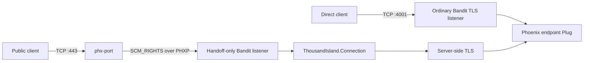
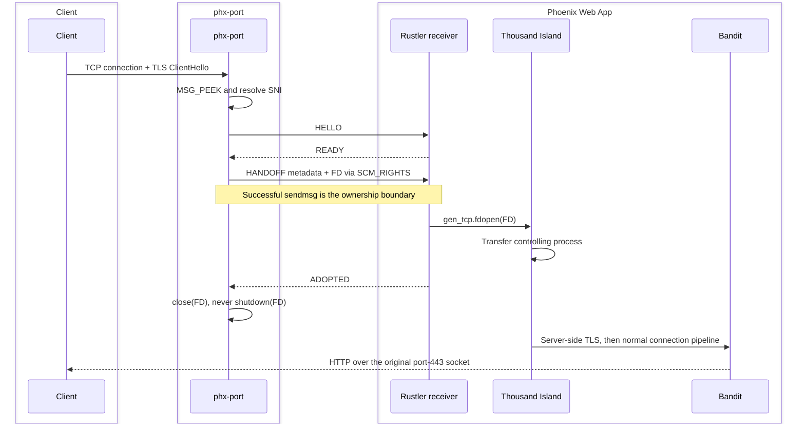

# Connected Socket Forwarding Design

## Status

The optional, cooperative Linux and macOS fast-path implementation is available
through the handoff-only second-server architecture described below. Darwin
application-level end-to-end validation is manual, not automation-complete.

The version 1 wire codec, endpoint derivation, same-UID capability handshake,
Rust `SCM_RIGHTS` sender, and six framework transport adapters are implemented:
Thousand Island/Bandit, Tokio/Axum, Go `net/http`, FastAPI/Uvicorn, and
Node/Fastify on Linux and macOS, plus Kestrel/ASP.NET Core on Linux. The
non-BEAM adapters independently implement the same PHXP protocol and
demonstrate that handoff is not tied to the BEAM. Existing
automated tests and manual integration runs have exercised independently
certificated Phoenix endpoints over HTTP/1.1, HTTP/2, and WebSockets through
dynamic SNI routing on original port-443 sockets, plus concurrent cross-site
requests and an in-VM handoff listener restart. The framework samples have
also been exercised through direct HTTP, direct trusted HTTPS, and
daemon-driven TLS handoff with the original peer and local socket addresses;
their protocol support remains whatever each underlying framework normally
provides.
These statements are implementation evidence, not a claim that every scenario
is covered by macOS CI.

Current `macos-latest` CI builds and runs the Rust unit tests for the daemon,
Rust sample, and native Rustler broker. It does not run the real daemon,
Phoenix HTTP/2/WebSockets, post-delivery fault injection, or cross-UID receiver
tests.

The daemon peeks without consuming the ClientHello, automatically attempts
handoff at a derived Unix-domain endpoint, and falls back to its ordinary TLS
relay only before a descriptor is delivered. Linux retains `SOCK_SEQPACKET`;
macOS uses `SOCK_STREAM` with bounded PHXP framing.

Combining ordinary TCP and handed-off connections within one native accept
broker remains future work. The current package runs an additional
handoff-only Bandit supervisor beside the ordinary Phoenix endpoint. The
tested receiver uses Rustler 0.36.2; Rustler 0.38 produced incompatible
descriptor ownership behavior and is intentionally excluded pending a
separate investigation.

This design complements
[`tls-proxy-design.md`](tls-proxy-design.md). The generic TLS proxy remains
usable with any SNI-capable TLS backend. Connected-socket forwarding provides
stronger source-address preservation and removes the relay from the established
connection's data path, but it requires explicit backend support.

## Context

The generic SNI passthrough design uses two TCP connections:

```text
client <-- TCP connection A --> phx-port <-- TCP connection B --> backend
```

phx-port inspects the TLS ClientHello on connection A, selects an HTTPS
backend, opens connection B, forwards the original ClientHello, and then copies
opaque TLS bytes in both directions.

This approach is portable across application languages and frameworks, but it
has three consequences:

- The backend sees phx-port's loopback address as its TCP peer instead of the
  client's address.
- phx-port remains in the data path for the lifetime of every connection.
- Every byte traverses two local sockets in addition to the client socket.

Linux and other Unix-like systems can pass an open file descriptor between
processes with `sendmsg(2)` and `SCM_RIGHTS`. Instead of relaying a client
connection, phx-port can transfer the accepted client socket to a cooperating
backend. The backend then terminates TLS and communicates directly over the
original kernel TCP connection.

The earlier socket-handoff proof of concept demonstrated descriptor transfer
between BEAM processes. The implemented package now carries that mechanism
through a production Bandit and Thousand Island connection lifecycle. The Rust
and .NET samples feed adopted sockets into Axum and Kestrel, respectively,
showing that another runtime only needs a narrow accepted-socket transport
adapter rather than a parallel HTTP implementation.

## Requirements

### Functional requirements

1. phx-port listens for public TLS connections on TCP port 443.
2. phx-port identifies the requested hostname from the TLS ClientHello without
   consuming bytes needed by the backend TLS stack.
3. A cooperating backend can both:
   - Accept ordinary TCP/TLS connections on its assigned phx-port HTTPS port.
   - Accept already-connected client sockets handed over by phx-port.
4. Both ingress paths enter the workload's ordinary web-server connection
   lifecycle and application pipeline.
5. The backend performs the TLS handshake and retains ownership of certificates
   and private keys.
6. The backend sees the original client address through the socket's
   `peername`.
7. phx-port releases all ownership of a successfully transferred connection
   and performs no subsequent byte forwarding.
8. The ordinary HTTPS listener remains available for route discovery, health
   checking, debugging, and direct access.
9. The generic TCP relay remains available for backends that do not implement
   socket handoff.

### Operational requirements

- Descriptor handoff is opt-in and capability-driven.
- The handoff channel is local, authenticated, and inaccessible to unrelated
  users.
- File-descriptor ownership is unambiguous at every stage.
- Failure before completed ownership transfer does not leak descriptors.
- Failure after transfer does not cause both processes to independently manage
  the same connection.
- Backend restart removes its handoff capability until its convention-derived
  handoff socket becomes available again.
- Connection telemetry distinguishes ordinary accepts, handed-off accepts, and
  relay fallback.

## Goals

- Preserve the client's real TCP source address without terminating TLS in
  phx-port.
- Remove phx-port from the connection data path after SNI routing.
- Reuse each web server's normal connection supervision, TLS handshake, HTTP
  implementation, and application lifecycle.
- Keep the backend independently reachable through its assigned HTTPS port.
- Confine BEAM-specific integration to a reusable Thousand Island transport.
- Keep socket handoff optional so non-cooperating backends continue to work.

## Non-goals

- Making descriptor handoff portable to Windows.
- Passing sockets to an unmodified application server.
- Moving established connections between different machines.
- Terminating TLS or reading private keys in phx-port.
- Replacing the generic TCP relay for all workloads.
- Handing off a partially consumed TLS stream.
- Migrating application or protocol state after the TLS handshake.
- Guaranteeing support for every runtime that can serve TLS.

## Chosen architecture

The backend exposes two ingress paths: its ordinary Phoenix HTTPS endpoint and
a second Bandit server using a custom `ThousandIsland.Transport`:



The ordinary endpoint uses Bandit's standard TLS transport. The handoff-only
server imports a raw connected TCP descriptor and passes it into the standard
Thousand Island connection process. Its `handshake/1` callback upgrades the
raw socket to TLS with the same server options as the ordinary endpoint.

The result is an ordinary Bandit connection after the transport handshake.
Bandit's HTTP/1.1, HTTP/2, WebSocket, Plug, and Phoenix behavior does not need a
separate implementation for handed-off sockets.

## Why ClientHello inspection does not consume the stream

phx-port must inspect incoming TLS data using `recv(2)` with `MSG_PEEK`.
Peeking copies available bytes to phx-port without advancing the socket's
receive queue.

The ClientHello may span multiple TCP segments. phx-port therefore repeats a
bounded peek until one of these conditions occurs:

- A complete ClientHello and SNI extension are available.
- The configured ClientHello size limit is exceeded.
- The read deadline expires.
- The client closes the connection.
- The data is malformed or is not a supported TLS ClientHello.

After successful inspection, the original bytes remain queued on the socket.
When the backend begins its TLS handshake, it reads the same ClientHello that
the client sent.

The implementation must not use an ordinary consuming read followed by
descriptor handoff. A general TCP socket has no operation for pushing consumed
bytes back into its receive queue.

## phx-port handoff sequence

For an active route whose backend advertises socket-handoff capability:

1. Accept the client connection on port 443.
2. Peek and parse the complete ClientHello.
3. Resolve or discover the SNI route as described in the TLS proxy design.
4. Confirm that the selected backend's handoff endpoint is currently ready.
5. Connect to the backend's Unix-domain control socket.
6. Send a small versioned handoff header and the connected client FD using
   `SCM_RIGHTS`.
7. Treat successful `sendmsg` as the ownership boundary. Linux closes
   phx-port's descriptor immediately; Darwin retains it as an inert lifetime
   guard until the receiver response, then closes it without `shutdown(2)`.
8. Wait for a bounded acknowledgement that reports whether the backend adopted
   the already-delivered socket.
9. Close the Unix-domain control connection after the response or timeout.
10. Remove all per-connection state from phx-port.

After successful `sendmsg`, the receiving process owns a duplicate descriptor
that refers to the same kernel socket object. Closing phx-port's descriptor
decrements the object's reference count but does not send a TCP FIN while the
backend descriptor remains open.

Unlike a BEAM-side release that must leave an Erlang port driver with a valid
descriptor, the Rust daemon can normally release its descriptor with
`close(2)`. It must not call `shutdown(2)`, because shutdown changes the shared
socket state for every descriptor referring to that connection.



## Backend handoff sequence

The backend transport:

1. Accepts the Unix-domain control connection.
2. Reads the versioned handoff header and receives the FD with `recvmsg(2)`.
3. Validates the message and peer credentials.
4. Wraps the descriptor as an Erlang `:gen_tcp` socket with
   `:gen_tcp.fdopen/2`.
5. Returns a tagged raw socket from its `accept/1` callback.
6. Allows Thousand Island to start the normal connection process.
7. Transfers socket ownership to that connection process through the
   transport's `controlling_process/2` callback.
8. Sends the handoff acknowledgement only after adoption succeeds.
9. Allows Thousand Island to call `peername/1` and construct its ordinary
   connection telemetry.
10. Upgrades the raw socket through the transport's `handshake/1` callback.
11. Continues through `Bandit.InitialHandler` and the ordinary request
    pipeline.

If the receiver cannot wrap or adopt the descriptor, it closes its copy and
returns a negative acknowledgement. Because descriptor delivery already
crossed the ownership boundary, phx-port records the failure and closes the
connection; it does not attempt relay fallback.

## Thousand Island integration

Thousand Island exposes the relevant abstraction through its
`ThousandIsland.Transport` behavior. Its normal acceptor path is conceptually:

```elixir
{:ok, raw_socket} = transport.accept(listener_socket)

:ok =
  ThousandIsland.Connection.start(
    connection_supervisor,
    raw_socket,
    server_config,
    handler_config,
    acceptor_span
  )
```

`ThousandIsland.Connection.start/5` starts the configured handler process,
calls the transport's `controlling_process/2`, and sends the raw socket to the
handler. The handler then calls:

```elixir
transport.peername(raw_socket)
transport.handshake(raw_socket)
```

This is the required seam: connection setup after `accept/1` does not depend on
whether the raw socket came from a TCP listener or `SCM_RIGHTS`.

The handoff integration uses the public transport behavior rather than calling
the internal `ThousandIsland.Connection` module directly. That keeps
connection limits, supervision, telemetry, shutdown behavior, and future
Thousand Island changes centralized.

## Future hybrid transport

The future conceptual backend module is:

```text
PhxPort.ThousandIsland.HandoffTransport
```

It implements every `ThousandIsland.Transport` callback and uses tagged values
to distinguish listener state, raw sockets, and negotiated TLS sockets.

The implemented `PhxPortHandoff.Transport` is handoff-only. It uses the same
raw and negotiated socket callbacks described below but creates only the
protected Unix-domain handoff listener. Its child-spec helper configures one
acceptor because entry into the blocking native accept NIF is serialized; this
avoids exhausting the dirty I/O scheduler pool.

### Future `listen/2`

`listen/2` receives the assigned backend port and the TLS transport options. It
creates:

- A raw TCP listener on the assigned port.
- A protected Unix-domain handoff listener.
- Shared state containing the server TLS options.

The raw TCP listener must use the socket options expected by Thousand Island,
but TLS-only options such as certificates, SNI callbacks, ALPN, and cipher
configuration are retained for `handshake/1` rather than passed to the TCP
listener.

### Future `accept/1`

`accept/1` waits for either:

- A normal connection accepted from the TCP listener.
- A connected descriptor received from phx-port over the handoff listener.

The future implementation would use a Rustler resource-backed native accept
broker. A dedicated native worker would use Linux `epoll` or Darwin `kqueue`
to multiplex both listener sources without blocking normal BEAM schedulers and
deliver accepted sockets to waiting Thousand Island acceptors. Elixir supervision would own the
broker lifecycle.

Multiple Thousand Island acceptors may invoke `accept/1` concurrently. The
broker queues waiters and accepted sockets so each descriptor is delivered to
exactly one acceptor.

### `controlling_process/2`

Before the TLS handshake, this callback transfers ownership of the raw TCP or
`:gen_tcp` socket to the newly started Thousand Island connection process.

The transport's tagged socket representation determines which operation is
appropriate.

### `handshake/1`

Both ordinary and handed-off connections reach this callback as raw connected
sockets. The callback performs a server-side upgrade:

```elixir
case :ssl.handshake(raw_socket, tls_options) do
  {:ok, ssl_socket} ->
    {:ok, negotiated_socket(ssl_socket)}

  {:ok, ssl_socket, _protocol_extensions} ->
    {:ok, negotiated_socket(ssl_socket)}

  other ->
    other
end
```

OTP 29 accepts a `:gen_tcp` socket in the server-side handshake, making an FD
wrapped with `:gen_tcp.fdopen/2` suitable for this upgrade path.

The `inet` driver treats an FD passed to `:gen_tcp.fdopen/2` as externally
owned and does not close it with the Erlang socket. A dedicated Elixir process
therefore holds the native receipt and monitors the imported Erlang port for
its full lifetime. The transport closes the raw `:gen_tcp` port after
`:ssl.close/1`; the monitor then observes `DOWN` and closes the native
descriptor. This ordering prevents the OS from reusing an FD number while the
old `tcp_inet` driver still has it registered. Descriptor import explicitly
selects `{:inet_backend, :inet}` so this lifecycle remains valid when the
VM-wide default is the newer `socket` backend, and selects `:inet` or `:inet6`
from the descriptor family returned by the NIF. Receipts retain the shared
duplicate-ID registry but not the broker's listening descriptor.

The implemented transport records `:inet.peername/1` and `:inet.sockname/1`
before TLS upgrade. On imported descriptors, OTP 29 may return `:ebadf` from
the corresponding `:ssl` address calls after a successful handshake. The
transport uses the cached kernel addresses only for that failure mode, while
returning the plain negotiated SSL socket expected by Thousand Island's active
message handling.

The implemented adapter supports OTP 29. Support for earlier releases would be
added only after the complete handoff path passes compatibility testing on
those releases.

The options must be the same options that an ordinary Bandit HTTPS listener
would use, including:

- Certificate and key configuration.
- SNI callback or SNI host configuration.
- ALPN protocols.
- TLS versions and cipher suites.
- Client-certificate policy.
- Socket mode and timeout options.

### Remaining callbacks

Before negotiation, callbacks such as `peername/1`, `sockname/1`, `close/1`,
and `controlling_process/2` operate on the raw socket.

After negotiation, these callbacks delegate to `:ssl`:

- `recv/3`
- `send/2`
- `sendfile/4`
- `shutdown/2`
- `close/1`
- `getopts/2`
- `setopts/2`
- `sockname/1`
- `peername/1`
- `peercert/1`
- `getstat/1`
- `negotiated_protocol/1`
- `connection_information/1`

`secure?/0` returns `true`.

## Bandit integration

Bandit builds a `ThousandIsland.ServerConfig` and accepts
`transport_module` through `thousand_island_options`. It uses `put_new` when
selecting its standard TCP or SSL transport, allowing an explicit transport
module to override the default.

Conceptual configuration:

```elixir
https: [
  port: String.to_integer(System.fetch_env!("SSL_PORT")),
  ip: {127, 0, 0, 1},
  certfile: ...,
  keyfile: ...,
  thousand_island_options: [
    transport_module: PhxPort.ThousandIsland.HandoffTransport
  ]
]
```

`PhxPortHandoff.bandit_child_spec/4` derives its development handoff socket
from the canonical project path and role. Public-hosting callers instead pass
the explicit `{:workload, logical_id}` identity used by their Route
Declaration. The helper preserves the endpoint's existing nested Thousand
Island TLS options and installs the handoff transport. It does not accept
certificate paths separately.

For SNI-only configurations, the transport calls the configured `sni_fun` with
the informational requested hostname to seed the base `certs_keys` required by
OTP before handshake. The callback remains installed and selects the
authoritative certificate from the untouched ClientHello.

## Implemented two-server architecture

The package uses two server instances:

1. The ordinary Phoenix HTTPS endpoint listens on its assigned TCP port.
2. A second Bandit instance uses a handoff-only transport and the same Phoenix
   endpoint module as its Plug.

Both instances run the same Bandit handlers and application endpoint, but they
have separate Thousand Island listener and connection supervisors.

This architecture proves:

- FD reception and wrapping.
- Socket ownership transfer.
- Server-side TLS upgrade on an imported socket.
- Original peer-address visibility.
- HTTP/1.1, HTTP/2, LiveView, and WebSocket operation.
- Correct close behavior.

The ordinary and handoff accept paths may later be combined in a hybrid
transport if sharing one connection limit and accept queue proves worthwhile.

## Handoff protocol

The PHXP v1 envelope is shared across two local transport profiles:

| Platform | Control transport | Framing |
|---|---|---|
| Linux | `AF_UNIX/SOCK_SEQPACKET` | One kernel-preserved packet per PHXP message |
| macOS | `AF_UNIX/SOCK_STREAM` | Fixed header plus checked payload length |

The descriptor-bearing `HANDOFF` frame begins in one `sendmsg` call with
exactly one FD in `SCM_RIGHTS`. On macOS, a positive partial `sendmsg` crosses
the ownership boundary; remaining bytes are written without resending the
ancillary data.

The Rust daemon and Rustler NIF implement the protocol independently against
the same written specification. The encoding uses network byte order, a
fixed-width envelope, and explicitly length-delimited UTF-8 fields. It does not
use native Rust struct layout, JSON, or a language-specific serializer.

Conceptual request:

```text
magic:            "PHXP"
version:          1
message_type:     HANDOFF
connection_id:    128-bit random identifier
peeked_length:    number of bytes inspected, not consumed
requested_sni:    normalized hostname
accepted_at:      monotonic timestamp metadata
descriptor:       SCM_RIGHTS ancillary data
```

Conceptual responses:

```text
ADOPTED(connection_id)
REJECTED(connection_id, reason_code)
```

Version 1 uses a 40-byte fixed header followed by at most 253 bytes of UTF-8
SNI. The complete PHXP frame is capped at 512 bytes:

| Offset | Width | Field |
|---:|---:|---|
| 0 | 4 | Magic bytes `PHXP` |
| 4 | 1 | Protocol version (`1`) |
| 5 | 1 | Message type (`HELLO=1`, `READY=2`, `HANDOFF=3`, `ADOPTED=4`, `REJECTED=5`) |
| 6 | 2 | Flags, zero in version 1 |
| 8 | 16 | Connection identifier |
| 24 | 4 | Peeked byte count, unsigned network byte order |
| 28 | 8 | Sender monotonic timestamp in nanoseconds, unsigned network byte order |
| 36 | 2 | Payload length, unsigned network byte order |
| 38 | 2 | Rejection reason code, unsigned network byte order |
| 40 | variable | UTF-8 SNI payload for `HANDOFF`; empty for every other message |

`HELLO` and `READY` form the capability/version handshake and require every
field after the message type to be zero. `ADOPTED` and `REJECTED` echo the
request's connection identifier. `REJECTED` requires a nonzero reason code.
All numeric fields use network byte order.

Version 1 rejection reason codes are:

| Code | Meaning |
|---:|---|
| 1 | The delivered descriptor is absent, malformed, or not a connected stream |
| 2 | The connection identifier is already active |
| 3 | The receiver could not adopt or schedule the delivered connection |

The header does not contain TLS payload. The TLS bytes remain in the passed
socket's kernel receive queue.

The SNI field is informational and supports diagnostics. The backend must not
treat it as authoritative; its TLS stack processes the original ClientHello
and selects the certificate independently.

Protocol parsing must use fixed bounds and must reject unknown versions,
unexpected descriptor counts, malformed lengths, and duplicate connection
identifiers.

## Handoff endpoint discovery

In the development Hosting Profile, the daemon derives the handoff socket path
from a hash of the canonical project path and port role:

```text
Linux: $XDG_RUNTIME_DIR/phx-port/handoff/<sha256(project-path NUL role)>.sock
macOS: /tmp/phx-port-<euid>/handoff/<sha256(project-path NUL role)>.sock
```

`PHX_PORT_RUNTIME_DIR` overrides the runtime root on both platforms, producing
`<runtime>/handoff/<hash>.sock`.

In the public Hosting Profile, ingress and the Workload instead hash the
explicit logical Workload ID and role. The production path is:

```text
/run/phx-port/handoff/<sha256(workload-id NUL role)>.sock
```

The Workload selects this identity explicitly; `PHX_PORT_WORKLOAD_ID` alone
remains an allocator setting. A nonempty `PHX_PORT_RUNTIME_DIR` replaces
`/run/phx-port` for both peers and is required for production use on macOS.
Ingress only connects to this endpoint. The Workload owns creation, stale
replacement, and removal, so ingress restart cannot remove live endpoints.

The fixed-length hash prevents collisions between repositories with the same
basename, avoids exposing project names, and remains within Unix socket path
limits. Before removing an existing path, the backend attempts to connect: a
live receiver makes startup fail, while an unreachable entry is treated as
stale and replaced. The broker monitors the BEAM listener process that created
it; listener exit stops the nonblocking accept loop and removes the endpoint
before a supervisor restart can bind its replacement.

When a `main` or `https` TLS workload becomes active, the daemon attempts a
version handshake at the derived path. Connection refusal or a missing path
means that handoff is unavailable and relay remains the compatibility path.
The daemon verifies the endpoint's effective UID with `SO_PEERCRED` on Linux
or `getpeereid` on macOS before sending a client descriptor.

Ordinary TLS probing on the assigned backend port remains authoritative for
route and certificate discovery. The handoff socket advertises only an
alternative data path; it never establishes hostname ownership.

## Source and destination addresses

A handed-off descriptor is the original socket accepted on port 443.
Consequently:

- `peername` reports the real client address and source port.
- `sockname` reports the address and port on which phx-port accepted the
  connection, normally local port 443.
- The backend does not see its assigned discovery port as the connection's
  destination port.

This is desirable for request telemetry but differs from a connection accepted
directly on the backend's assigned port. Application code must use the
configured public URL and HTTP `Host` authority rather than infer its canonical
external URL solely from the local socket port.

## Ownership and close semantics

Descriptor transfer duplicates a reference to one kernel socket object.
Correct ownership transitions are essential.

### Before `sendmsg`

phx-port is the only owner. If routing or control-channel setup fails, phx-port
closes the client socket.

### After successful `sendmsg`, before acknowledgement

Both processes have descriptors. Neither process may call `shutdown`.

The backend either:

- Adopts the socket and acknowledges it.
- Closes its descriptor and rejects it.
- Disconnects before responding.

The implementation handles the ambiguous case where the descriptor was
delivered but the acknowledgement was lost as follows:

- The backend treats descriptor receipt as ownership transfer.
- phx-port permanently stops using the descriptor when `sendmsg` succeeds.
- Linux closes its copy immediately. Darwin keeps an inert copy until a
  response, EOF, or timeout, then closes it regardless of the outcome.
- The acknowledgement is used for telemetry and failure reporting, not as a
  transactional rollback boundary.

This avoids two processes retaining a connection indefinitely. It also means a
backend failure immediately after receipt closes the client connection rather
than falling back to relay.

### After handoff

The backend is the sole owner. phx-port must not retain a descriptor, call
shutdown, monitor payload traffic, or attempt to reclaim the connection.

### BEAM descriptor release

If a BEAM process ever transfers an already wrapped socket onward, closing via
the ordinary Erlang socket API may call `shutdown`, affecting all holders.
Replacing the transferred descriptor with `/dev/null` using `dup2` is
applicable in that specific case. It is not needed for the Rust sender's normal
post-`sendmsg` close.

## Failure and fallback behavior

| Failure | Behavior |
|---|---|
| Backend has no handoff capability | Use generic TCP relay |
| Handoff endpoint is unavailable before `sendmsg` | Mark capability unhealthy and use relay |
| `sendmsg` fails | Retain client ownership and use relay if still safe |
| Descriptor delivered, backend rejects or crashes | Close connection; do not attempt relay |
| ClientHello peek fails | Close connection |
| SNI route is unknown | Perform normal lazy route discovery first |
| Backend TLS handshake fails | Backend closes the connection and records the TLS error |
| Backend restarts | Disable handoff until its derived socket is healthy again |

Relay fallback is safe only while phx-port still owns the sole usable
descriptor and no consuming read has occurred. Once a descriptor has been
successfully sent, the implementation does not attempt to convert that
connection into a relay.

## Security

The handoff channel grants the receiver control over public client
connections. It therefore requires stronger protection than an ordinary local
health endpoint.

- Place Unix sockets in a user-owned runtime directory such as
  `$XDG_RUNTIME_DIR/phx-port/` on Linux or `/tmp/phx-port-<euid>/` on macOS.
- Use restrictive directory and socket permissions.
- Verify peer credentials with `SO_PEERCRED` or the platform equivalent.
- Require the daemon and backend to have the same effective UID.
- Use unpredictable or project-bound socket names.
- Treat a missing or unreachable receiver endpoint as unavailable capability.
- Permit only one descriptor per handoff request.
- Validate that received descriptors refer to connected stream sockets.
- Bound control-message and ancillary-data sizes.
- Never trust header SNI in place of parsing the actual TLS ClientHello.
- Do not log TLS payload or descriptor values as durable identifiers.

A malicious process running as the same user may still be able to interfere
with same-user IPC. Protecting against a fully compromised same-user process is
outside the initial threat model.

## Portability

`SCM_RIGHTS` is Unix-specific. The implementation explicitly targets Linux and
macOS rather than enabling every Unix target without platform tests.

The capability must be detected at build time and runtime:

- Linux or macOS with a compatible backend adapter: socket handoff.
- Other Unix platforms: future support after explicit testing.
- Windows or unsupported runtimes: generic TCP relay.

The public TLS routing behavior must not depend on socket handoff being
available.

The repository currently contains two Linux/macOS receiver implementations and
one Linux-only receiver:

- Phoenix/Bandit through Rustler and a custom Thousand Island transport.
- Rust through Tokio, tokio-rustls, Hyper, and a shared Axum router.
- Linux-only .NET 10 through a custom public Kestrel
  `IConnectionListenerFactory` and the
  same ASP.NET Core middleware used by its ordinary listeners.

All three keep certificate handling, ALPN, HTTP/1.1, HTTP/2, and request
dispatch in the standard server stack. PHXP-specific code ends after
descriptor validation and adaptation to the framework's connection transport.

## Performance expectations

Compared with generic relay:

- The initial `MSG_PEEK`, route lookup, UDS connection, and `sendmsg` add setup
  work to each accepted connection.
- After transfer, phx-port performs no payload reads, writes, encryption, or
  copying.
- The backend communicates directly with the client through the original
  kernel socket.
- Long-lived WebSocket, HTTP/2, gRPC, and streaming connections benefit most.

The implementation currently prefers handoff automatically when a compatible
receiver is present. It should still be benchmarked against the generic relay
before being presented as a general production default. Connection setup rate,
tail latency, descriptor pressure, scheduler impact, and failure behavior are
more important than synthetic bulk throughput alone.

## Observability

`phx-port proxy status` currently exposes counters for:

- Connections accepted on port 443.
- Successful certificate-verified route discoveries.
- Handoff attempts.
- Successful descriptor transfers.
- Handoff unavailability and pre-delivery relay fallback.
- Failures after descriptor delivery.
- Relayed and rejected connections.

Structured events, acknowledgement-latency histograms, active-capability
reporting, and explicit ingress metadata in Thousand Island telemetry remain
future observability work. The intended metadata shape is:

```text
ingress = direct | phx_port_handoff
```

The original remote address remains the standard connection peer metadata.

## Validation strategy

### Transport tests

- Receive an FD over `SCM_RIGHTS` and complete the same TLS handshake.
- Confirm direct and handoff server instances invoke the same Bandit handler.
- Confirm `peername` reports the original client for handed-off sockets.
- Confirm `sockname` reports port 443 for handed-off sockets.
- Exercise certificate selection through backend SNI configuration.
- Exercise ALPN negotiation for HTTP/1.1 and HTTP/2.
- Verify socket closure on every failure branch.
- Verify duplicate connection identifiers are rejected.

### phx-port tests

- Parse fragmented ClientHello data using only `MSG_PEEK`.
- Verify the backend receives the complete original ClientHello.
- Transfer a descriptor and release the sender copy without emitting FIN.
- Reject malformed control responses.
- Fall back to relay when capability setup fails before `sendmsg`.
- Do not fall back after successful descriptor delivery.
- Disable capability after backend restart or UDS disappearance.

### End-to-end tests

- Serve the same Phoenix endpoint through direct port access and socket
  handoff.
- Verify normal requests, LiveView WebSockets, HTTP/2, and streaming responses.
- Verify request telemetry contains the real client IP after handoff.
- Rotate backend certificates without restarting phx-port.
- Stop and restart the backend while repeatedly opening connections.
- Compare descriptor counts before and after sustained load to detect leaks.
- Compare latency and CPU utilization with generic TCP relay.

The HTTP/1.1, HTTP/2, LiveView WebSocket, original peer-address, concurrent
cross-site, and in-VM listener restart scenarios have been exercised end to
end in Phoenix. The standalone Rust, .NET 10, Go, Python, and Node receivers
have also been built and exercised through certificate discovery and real
daemon handoff using local fixture certificates. Certificate rotation under load and
comparative performance benchmarks remain outstanding. Manual validation on
macOS arm64 transferred an untouched TCP descriptor with explicit
close-on-exec checks. Bandit and Axum completed trusted handed-off TLS over
HTTP/1.1 and HTTP/2 with original peer and local addresses; Phoenix Channel
WebSockets completed join and sustained bidirectional traffic. Stress runs
completed 160 Phoenix requests, 32 concurrent Phoenix Channel WebSockets, and
80 Rust requests without descriptor growth. IPv6 HTTP/1.1, HTTP/2, Phoenix
Channel, and concurrent Phoenix/Rust handoffs also completed with preserved
IPv6 addresses. Endpoint disappearance and a wrong-UID daemon peer both fell
back to relay before delivery, and receiver restart restored handoff.

The Darwin application results in this section are manual runs. They are not
currently reproduced by the committed macOS workflow. In particular,
post-delivery rejection and timeout, a real partial-positive-`sendmsg`
remainder failure, Phoenix HTTP/2/WebSockets, and receiver-side wrong-UID
rejection remain automation gaps.

## Delivery status

1. [x] Build a handoff-only Thousand Island transport.
2. [x] Start a second Bandit instance using the Phoenix endpoint as its Plug.
3. [x] Transfer untouched client sockets through the versioned PHXP protocol.
4. [x] Prove TLS, HTTP/1.1, HTTP/2, peer-address preservation, and closure.
5. [x] Add automatic handoff selection and safe pre-delivery relay fallback.
6. [x] Prove LiveView WebSocket upgrade, concurrent cross-site traffic, and
   in-VM listener restart.
7. [x] Prove PHXP interoperability with standalone Rust and .NET 10 receivers.
8. [x] Port the daemon, Phoenix/Bandit receiver, and Rust sample to macOS.
9. [x] Add Go, FastAPI/Uvicorn, and Node/Fastify receivers for Linux and macOS.
10. [ ] Commit reproducible Darwin end-to-end coverage for post-delivery
   failures, Phoenix HTTP/2/WebSockets, cross-UID rejection, concurrency,
   restart, and descriptor lifecycle.
11. [ ] Replace serialized blocking accepts with a supervised native worker and
   queue if benchmarks show it is needed.
12. [ ] Evaluate combining ordinary TCP and handoff acceptance in one hybrid
   transport.
13. [ ] Benchmark and harden before presenting handoff as a general production
   default.

## Resolved implementation choices

- Use `SOCK_SEQPACKET` on Linux and framed `SOCK_STREAM` on macOS.
- Begin the fixed binary frame and one FD in a single descriptor-bearing
  `sendmsg`; never resend ancillary data when completing a partial stream
  write.
- Implement the wire encoding independently in the daemon and NIF against one
  written specification.
- Use a Rustler resource-backed native accept broker supervised from Elixir.
- Keep separate Thousand Island listener and connection supervisors in the
  implemented two-server architecture; sharing them remains a possible hybrid
  transport refinement.
- Support OTP 29 initially.
- Derive development handoff sockets from canonical project path and role, and
  public-hosting sockets from explicit logical Workload ID and role.
- Prefer handoff automatically when its endpoint is healthy.
- Fall back to relay only before successful descriptor transfer.
- Treat successful `sendmsg` as the ownership boundary.
- Infer backend shutdown through daemon health checks rather than an explicit
  draining message.
- Use a handoff-only second Bandit server now; implement a hybrid listener only
  if shared limits or measured performance justify the additional complexity.
- Keep the Elixir adapter as an independently versioned Mix package under
  `phx_port_handoff` in this repository.
- Keep the Elixir, Rust, .NET, Go, Python, and Node implementations as focused
  interoperability examples under `samples`; they stop at each framework's
  accepted-socket boundary rather than replacing its TLS or HTTP stack.

The remaining questions are empirical rather than architectural: scheduler
impact, socket option compatibility, comparative performance, sustained
descriptor behavior, and whether tested OTP releases older than 29 can be
supported later. Rustler 0.38 also requires a separate ownership investigation:
it produced `tcp_inet` descriptor-control conflicts after successful request
handling, so the verified integration remains pinned to Rustler 0.36.2.

## Decision summary

Connected-socket forwarding is feasible for cooperating Linux and macOS
backends.
phx-port can inspect SNI with `MSG_PEEK`, transfer the untouched client socket
through `SCM_RIGHTS`, and leave the backend talking directly to the original
client connection.

For Phoenix applications, a custom `ThousandIsland.Transport` accepts handed
off descriptors, performs the server-side TLS handshake, and feeds them into
the normal Bandit connection pipeline. The ordinary Phoenix endpoint continues
to accept direct TLS traffic separately. Both paths use the same Phoenix Plug
and TLS configuration. Standalone Rust, .NET 10, Go, Python, and Node examples validate
the same wire protocol and descriptor lifecycle outside the BEAM. All preserve
the client's real peer address and remove phx-port from the established
connection's data path.

Because this requires a backend adapter and Unix descriptor passing, it is an
optional optimization. The framework-independent TCP relay defined in the TLS
proxy design remains the compatibility path.
