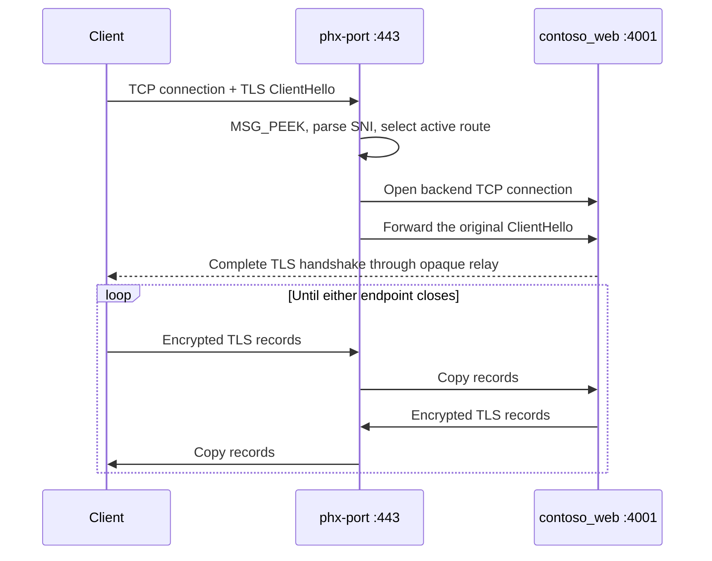
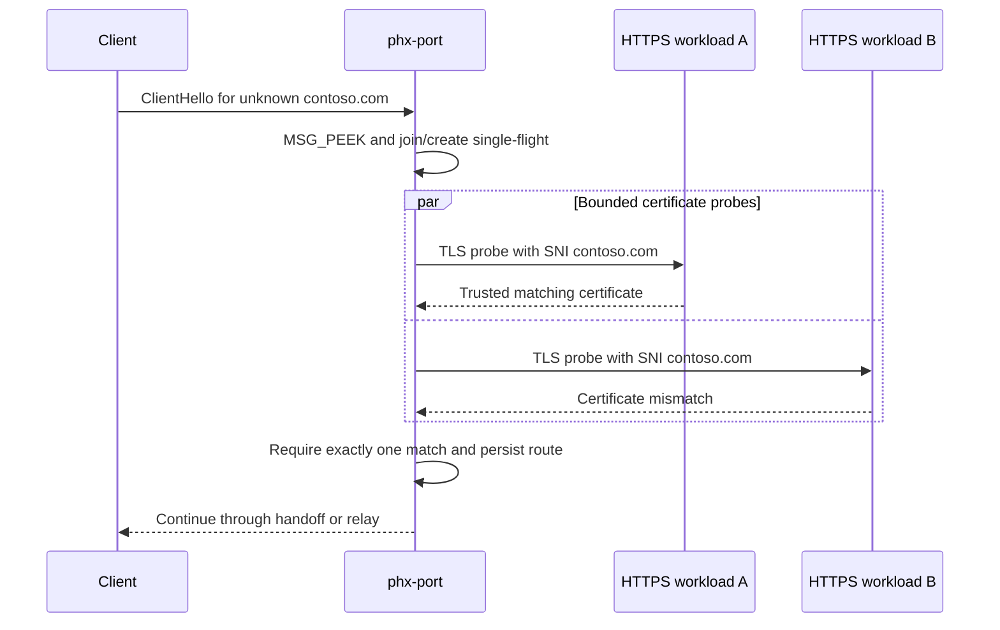
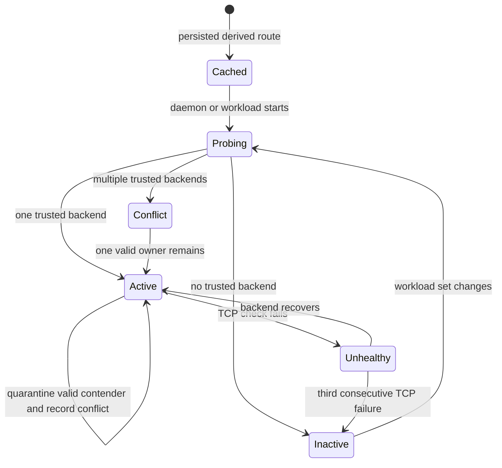

# Dynamic TLS/SNI Proxy Design

## Status

Implemented. The daemon, eager and lazy certificate discovery, persistent
derived routes, conflict handling, health reconciliation, control socket,
systemd user-service management, and generic TLS relay are operational.

On Linux, a compatible workload can additionally receive the original client
descriptor through the optional socket-handoff path described in
[`socket-forwarding-design.md`](socket-forwarding-design.md). The generic relay
remains the framework-independent baseline.

## Context

`phx-port` assigns stable, collision-free ports to local projects and can
probe the registry to identify which assigned ports are currently listening.
Several applications may need to run concurrently with their production TLS
configuration while remaining reachable through the standard TLS port:

```text
https://www.contoso.com:443  -> https://127.0.0.1:4001
https://contoso.com:443      -> https://127.0.0.1:4001
https://www.fabrikam.com:443 -> https://127.0.0.1:4002
```

Only one process can bind TCP port 443. `phx-port` therefore runs a long-lived
daemon that routes incoming TLS connections to active registered workloads
according to Server Name Indication (SNI).

For example, a workload at `/home/user/projects/contoso_web` may serve two
hostnames using two certificates selected by its TLS SNI callback:

- `www.contoso.com`
- `contoso.com`

The design is not specific to Elixir, Phoenix, Bandit, or HTTP.

## Requirements

### Functional requirements

1. `phx-port` can run as a long-lived daemon listening on TCP port 443.
2. Registered workloads continue to receive stable ports from the existing
   port registry.
3. Backends use HTTPS and retain ownership of their certificates and private
   keys.
4. The daemon discovers when registered HTTPS workloads start and stop.
5. The daemon eagerly discovers hostnames from each new `https` workload's
   default certificate when that workload supports a TLS handshake without
   SNI.
6. When a client requests an unknown SNI hostname, the daemon probes a bounded
   set of active HTTPS workloads using that hostname as SNI.
7. A hostname is routed only when exactly one backend presents a valid,
   matching certificate.
8. Successful lazy discoveries are cached persistently.
9. Cached routes are revalidated before activation after daemon or workload
   restart.
10. New connections stop routing to a workload after that workload stops.
11. Existing proxied connections may drain naturally.
12. Workloads may be implemented in any language or framework.
13. LiveView, WebSockets, HTTP/2, gRPC, and other SNI-bearing TLS protocols
    pass through without protocol-specific proxy support.
14. Certificate rotation at a backend does not require restarting or
    reconfiguring the phx-port daemon.

### Operational requirements

- No backend certificate or private-key paths are stored in the phx-port
  configuration.
- Private-key material is never read, copied, or held by phx-port.
- The first connection for an unknown hostname incurs a bounded discovery
  delay.
- Unknown-host discovery is concurrency-limited and resistant to abuse.
- Route conflicts, activation, deactivation, and certificate changes are
  observable.
- The daemon can run as an unprivileged user where the operating system permits
  binding port 443.
- Each workload controls whether its backend port binds to loopback or other
  interfaces. Loopback remains the safer default when direct LAN access is not
  required.

## Goals

- Preserve production-equivalent TLS behavior in each workload.
- Require no duplicate list of certificate and key paths.
- Make hostname routing self-configuring for active workloads.
- Keep the proxy independent of application language and application protocol.
- Minimize the amount of TLS and HTTP behavior implemented by phx-port.
- Fail closed for unknown, invalid, expired, or ambiguous hostnames.
- Keep the existing stable-port workflow intact.

## Non-goals

- Terminating TLS in phx-port.
- Managing or renewing certificates.
- Reading Phoenix or other framework configuration files.
- Discovering private keys from process state, source trees, environment
  variables, or open file descriptors.
- Acting as an HTTP reverse proxy or modifying HTTP requests and responses.
- Routing plaintext protocols through the port 443 listener.
- Routing TLS clients that provide neither SNI nor another configured routing
  identity.
- Replacing public DNS. DNS must still direct each public hostname to the
  machine running the daemon.

## Chosen architecture: SNI passthrough

The daemon is a layer-4 TCP proxy with TLS ClientHello inspection. It does not
terminate TLS:



The daemon peeks at a bounded ClientHello without consuming it, extracts its
SNI hostname, and selects a route. If socket handoff is unavailable, it opens
the backend TCP connection, consumes exactly the bytes that were peeked,
writes them unchanged to the backend, and then copies bytes bidirectionally
until either side closes.

Because the original handshake reaches the backend:

- The backend proves possession of the certificate's private key directly to
  the client.
- Application TLS versions, cipher suites, ALPN, client-certificate policy,
  OCSP behavior, and session handling remain authoritative.
- phx-port has no certificates to reload. Backend certificate hot reloading is
  immediately effective for new connections.
- phx-port does not need HTTP, WebSocket, or HTTP/2 proxy implementations.

The daemon maintains an **SNI route table**, not an SNI certificate list.

## Commands and port roles

The daemon entry point is an explicit, foreground command:

```bash
phx-port daemon --listen 0.0.0.0:443 --listen '[::]:443'
```

The transitional threaded configuration defaults to 256 active connections,
128 pre-routing connections, 128 relays, 64 handoff negotiations, 200 accepts
per second with burst 400, and a two-second ClientHello deadline. Per-source
defaults are 20 accepts per second, burst 40, and 16 simultaneous pre-routing
connections. IPv4 buckets are exact addresses; IPv6 buckets use `/64` by
default. The source table defaults to 4096 entries and a 300-second TTL. Each
value has a matching `daemon` option. `--task-budget` can declare an operator
task ceiling; on Linux the daemon also reads the enclosing systemd cgroup task
limit when one exists.

Capacity validation runs before the first listener bind. It rejects zero
limits, sublimits above the global limit, ClientHello deadlines outside
500-10000 milliseconds, arithmetic overflow, active limits above the
threaded ceiling, task demand above the configured/systemd budget, and
descriptor demand that would leave less than 30% of `RLIMIT_NOFILE` in
reserve. When the configured descriptor budget fits the hard limit, startup
may raise the process soft limit to the calculated minimum and then revalidates
the resulting limit. It never derives or lowers configured ingress ceilings
from ambient limits. The validated ClientHello timeout is already used by connection handling. The
daemon also enforces the global accept-rate/burst and active, source,
pre-routing, relay, and handoff ceilings. It derives source identity only from
the kernel-reported peer address and acquires active, source, and pre-routing
permits immediately after `accept`, before dispatch to a fixed worker pool with
one bounded queue slot. Saturation closes the new socket without allocating a
per-connection thread. Relay capacity is reserved before opening the loopback
backend; after route selection, source and pre-routing capacity are released
while active and relay permits remain held until copying ends. Production load
qualification remains a later milestone, so these threaded bounds do not
constitute a public-load support claim.

Operator-only CIDR policy is configured with repeatable
`--source-policy CIDR=RATE,BURST,PRE_ROUTING[,IPV6_PREFIX]` options. Longest
prefix wins, normalized duplicates and unsafe IPv6 prefix relationships fail
startup, and the override list is capped at 256. No ClientHello, SNI, header,
or other client-provided protocol value can select a policy.

`daemon` is preferable to a global `--daemon` option because it has its own
lifecycle, configuration, status, and diagnostics. The IPv4 and IPv6 listeners
are separate; the IPv6 listener uses IPv6-only mode to avoid
platform-dependent dual-stack behavior.

The daemon does not self-background. An installable systemd user service owns
restart policy, startup, logging, and supervision. On systems that do not
permit an unprivileged process to bind port 443, startup fails with a clear
privilege diagnostic rather than attempting privilege escalation.

On Linux, `phx-port proxy install-service` writes the user unit under
`$XDG_CONFIG_HOME/systemd/user` (falling back to
`~/.config/systemd/user`), with absolute paths for both the current executable
and registry. It then runs `systemctl --user daemon-reload` and
`systemctl --user enable --now phx-port.service`. The unit uses
`Restart=on-failure` and allows 35 seconds for the daemon's bounded shutdown
drain. `phx-port proxy uninstall-service` disables and stops the service,
removes the unit, and reloads the user manager.

HTTPS workloads use a conventional named role:

```bash
export SSL_PORT="${SSL_PORT:-$(phx-port https)}"
exec application-server
```

For example, a Phoenix endpoint may bind its assigned HTTPS listener to
loopback:

```elixir
https: [
  port: String.to_integer(System.fetch_env!("SSL_PORT")),
  ip: {127, 0, 0, 1},
  certfile: ...,
  keyfile: ...
]
```

Lazy discovery probes both `https` and `main` roles for TLS. `https` is
preferred when both roles in one project validly serve the same hostname;
`main` provides compatibility for projects that already use their default role
for HTTPS. Eager no-SNI discovery is restricted to `https`, avoiding
speculative TLS traffic and warnings on ordinary clear-HTTP `main` listeners.
Matching roles in different projects still invoke the hostname-conflict
policy.

The daemon exposes a current-user-only Unix control socket and supports:

```text
phx-port proxy status
phx-port proxy routes
phx-port proxy stop
```

The socket is `$XDG_RUNTIME_DIR/phx-port/control.sock` when
`XDG_RUNTIME_DIR` is set, and otherwise lives under a private
`phx-port-runtime` directory beside the registry. The directory mode is
`0700`; the socket mode is `0600`. Startup removes a stale socket but refuses
to replace one whose daemon responds.

`status` reports listener addresses, route and conflict counts, current and
configured admission capacity, fixed worker and queue bounds, bounded
rejection-reason counters, discovery resource usage, connection/discovery
counters, handoff capacity skips, and handoff outcomes.
Admission saturation writes fixed-schema `event=ingress_overload` records to
stderr at most once per bounded reason every ten seconds. Repeated rejections
within the interval are counted and suppressed, then reported as one aggregate
when that reason next emits. These events contain only a fixed reason name and
numeric counts, never a source address, arbitrary SNI, or per-connection error
string.
`routes` returns the live active and conflicting route table while the daemon
is reachable, then falls back to cached registry state for offline diagnostics.
`stop` requests graceful shutdown: listeners and reconciliation stop accepting
new work, existing relays receive up to 30 seconds to finish, and the control
socket is removed.

## Workload discovery

The daemon rereads and reconciles the existing port registry once per second.
This simple polling model also handles atomic registry replacement without
requiring platform-specific filesystem notification behavior.

For each registered `https` or `main` role, the daemon tracks:

- Canonical project path.
- Port role and assigned port.
- TCP listener availability.
- Hostnames currently verified for the workload and their leaf-certificate
  fingerprints.
- Last TLS verification time and consecutive TCP failure count for active
  routes.

A TCP connect alone is insufficient for routing. A workload becomes eligible
for a hostname after one complete TLS probe for that hostname succeeds with
certificate and hostname validation. Failure to present a no-SNI default
certificate disables eager discovery for that workload but does not prevent
exact-SNI lazy discovery.

The daemon must connect only to loopback addresses derived from registered
ports. Discovery data must never be able to turn the daemon into a proxy for
arbitrary network destinations.

## Eager hostname discovery

When an explicit `https` workload becomes ready, the daemon attempts to connect
without SNI and examine the default certificate presented by that workload.
This is opportunistic: strictly SNI-only servers may reject that handshake, in
which case the workload remains discoverable through the lazy path. Workloads
serving HTTPS through the compatibility `main` role also use lazy discovery.

Every exact DNS Subject Alternative Name (SAN) in the certificate becomes a
candidate. The daemon then performs an SNI-specific TLS probe for each
candidate. A route is activated only if:

1. The TLS handshake demonstrates possession of the corresponding private key.
2. The certificate chain is trusted according to the daemon's trust policy.
3. The certificate is currently valid.
4. The certificate covers the candidate hostname according to standard TLS
   hostname-verification rules.
5. No other active backend owns the same hostname.

The Common Name is not used when the certificate contains DNS SANs.

A wildcard SAN cannot enumerate all hostnames that an application intends to
serve. It may validate a concrete hostname during lazy discovery, but it does
not eagerly create an unbounded set of routes.

## Lazy discovery for unknown SNI

A backend may select additional certificates that are not visible in its
default handshake. TLS provides no operation that enumerates all SNI names
supported by a server. Unknown incoming names therefore trigger targeted
discovery.

For an incoming ClientHello with an unknown hostname:

1. Validate and normalize the requested DNS hostname.
2. Peek at the original ClientHello without consuming it or replying.
3. Join any discovery already in progress for that hostname.
4. Concurrently probe up to 32 active HTTPS workloads, using the requested
   hostname as SNI.
5. Validate each returned certificate and handshake against that hostname.
6. If exactly one backend matches, atomically add the route.
7. Deliver the untouched connection by socket handoff when available;
   otherwise connect to the backend and forward the original ClientHello
   unchanged.
8. Persist the successful mapping as derived cache state.



The original client socket waits for at most 250 milliseconds while discovery
runs. At most 64 client connections may wait for discovery, and at most 32
backend TLS probes may run concurrently. Simultaneous discoveries for the same
normalized hostname share one single-flight operation.

Applied to the motivating example:

1. A default probe may discover `www.contoso.com`; an SNI-only backend simply
   skips this optimization.
2. The first client requesting `contoso.com` causes an exact-SNI
   fan-out.
3. `contoso_web` selects and presents its apex certificate.
4. phx-port validates it and records the apex hostname route.
5. Later connections use the route without another fan-out.

If no backend matches within the discovery deadline, the daemon closes the
connection. Because phx-port does not terminate TLS, it cannot return an HTTPS
error page.

## Route persistence

Discovered routes are stored in a clearly separated
`[discovered_routes]` table within the existing phx-port TOML registry. The
`[ports]` table remains authoritative configuration; discovered routes remain
derived, disposable state.

Conceptual cache entry:

```toml
[discovered_routes."contoso.com"]
project = "/home/user/projects/contoso_web"
role = "https"
certificate_fingerprint = "A7:9A:77:DA:F6:4F:21:0E:..."
last_verified_unix = 1788114730
```

The cache stores a project identity and role rather than only a socket address.
Stable port allocation remains authoritative for resolving the current
backend address.

Cached entries are hints, not authorization. On daemon startup or workload
restart, a cached route remains inactive until an SNI-specific probe verifies
it again. If revalidation fails, the cache entry may remain available for
diagnostics but cannot receive connections.

Every daemon and CLI read-modify-write operation takes an advisory lock on a
sibling lock file. Writes use a temporary file, `fsync`, and atomic rename so a
route discovery cannot overwrite a simultaneous port registration or deletion.

A positive route remains cached while its project and role remain registered,
even when the workload is stopped. Removing that registration removes its
derived routes. A newly presented valid certificate that no longer covers a
cached hostname also removes the route.

## Route lifecycle

Routes have the following conceptual states. The implementation stores active
routes plus their failure counters rather than materializing every state as a
separate enum:



- **Cached:** Persisted mapping has not yet been verified in this daemon
  lifetime.
- **Probing:** TLS readiness or hostname ownership is being checked.
- **Active:** New connections may use the route.
- **Unhealthy:** One or more recent checks failed, but the failure threshold
  has not been reached.
- **Inactive:** New connections are rejected because the workload is stopped
  or verification failed.
- **Conflict:** More than one active workload validly presents a certificate
  for the hostname.

One complete, valid TLS handshake activates a workload. Active workloads
receive a TCP liveness probe once per second and deactivate after three
consecutive failures. Hostname-specific TLS revalidation runs every 30 seconds
and immediately after a stopped workload returns. A successful liveness probe
resets the failure count.

Route-table replacement must be atomic. Each accepted connection uses a
snapshot of the selected route:

- New connections stop using a route immediately after deactivation.
- Existing connections continue until either endpoint closes.
- Workload restart does not forcibly terminate unrelated connections.

TLS revalidation first probes only the incumbent using the known hostname as
SNI, allowing the daemon to detect certificate expiration, hostname removal,
or certificate rotation without generating TLS traffic against unrelated
clear-HTTP workloads. A failed incumbent triggers full candidate fan-out for
failover. Newly added explicit `https` workloads are checked for conflicts
through eager discovery. Rotated certificates are served immediately by the
backend because phx-port does not terminate TLS.

## Conflicts

If multiple active workloads present valid certificates for the same requested
hostname, discovery is ambiguous. The daemon must:

- Preserve an already active, still-valid incumbent.
- Quarantine a newly discovered contender for that hostname.
- Activate no route if multiple contenders appear without an incumbent, such
  as during daemon startup.
- Record all conflicting project identities and ports.
- Emit a clear diagnostic.
- Retry after workload or certificate state changes.

Response order, port number, project path ordering, or most-recent startup must
never be used as an implicit tie-breaker.

## Trust policy

Probe validation uses the operating system's trusted root
store and standard DNS hostname verification. This proves that a local
workload holds a certificate trusted for the requested public name.

Support for private development certificate authorities may be added through
an explicit daemon trust-store option. Disabling certificate verification is
not an acceptable discovery mode because any local process could then claim
any hostname.

The probe must validate the complete chain presented by the backend while
tolerating conventional extra certificates after the usable chain.

## Abuse resistance and resource limits

Lazy discovery turns an unknown SNI value into fan-out work and therefore
requires strict bounds. The implementation currently:

- Reject malformed, non-DNS, oversized, or missing SNI values.
- Limits ClientHello inspection to 64 KiB and a startup-validated 500-10000
  millisecond deadline (two seconds by default).
- Gives discovery a 250 millisecond deadline.
- Applies a token bucket and simultaneous pre-routing ceiling to exact IPv4
  peers and configurable-prefix IPv6 peers before worker dispatch.
- Keeps at most 4096 source entries by default, expires idle entries after 300
  seconds, evicts the deterministic least-recent idle entry at capacity, and
  rejects a new source if every retained entry is active.
- Permits at most 64 waiting clients and 32 concurrent backend probes.
- Probes at most 32 live candidate registrations per discovery.
- Uses one single-flight operation per normalized hostname.
- Keeps at most 1,024 negative entries for 30 seconds.
- Invalidates negative entries when the live workload set changes.
- Performs only loopback TCP/TLS probes; it does not follow redirects or make
  HTTP requests.
- Does not log certificate contents, key material, or TLS payload.

Once a route exists, forwarding does not require additional TLS parsing beyond
the initial ClientHello.

A wildcard certificate may validate a concrete hostname during lazy
discovery, but the daemon caches only that observed hostname. It never creates
an implicit wildcard route from the certificate.

A bound on positive persisted routes remains separate hardening work.

## Failure behavior

| Condition | Behavior |
|---|---|
| Missing SNI | Close the connection |
| Malformed ClientHello | Close the connection and record a bounded diagnostic |
| Known active hostname | Attempt handoff, then relay if handoff is unavailable |
| Cached but inactive hostname | Revalidate the cached backend, then fan out if needed |
| Unknown hostname | Run bounded lazy discovery |
| No matching backend | Negative-cache and close |
| Multiple matching backends without a valid incumbent | Mark conflict and close |
| Valid incumbent plus a new matching contender | Preserve incumbent and quarantine contender |
| Backend stops | Deactivate its routes after the failure threshold |
| Backend restarts | Revalidate cached routes and reactivate |
| Certificate rotates validly | Update fingerprint and retain the route |
| Certificate expires or drops hostname | Deactivate the affected route |

## Implemented components

The daemon is implemented in Rust with OS threads and synchronized shared
state. Accepted connections enter a fixed worker pool only after obtaining
global, source, and pre-routing admission permits. Source state, the one-slot
user-space queue, active workers, relay copy threads, and certificate-probe
threads all have hard bounds. Probe permits are acquired before their threads
are created, and single-flight discovery prevents duplicate work for one SNI
hostname. The implementation consists of:

- `admission.rs` for global/source token buckets, bounded source state, and
  RAII connection-stage capacity.
- `worker_pool.rs` for fixed bounded connection execution.
- `proxy.rs` for listeners, reconciliation, discovery, route health, control,
  handoff selection, and relay.
- `tls_client_hello.rs` for bounded, non-consuming ClientHello inspection.
- `route_cache.rs` for atomically persisted derived routes.
- `handoff.rs` and `handoff_protocol.rs` for the optional Linux descriptor
  transfer path.
- The existing registry helpers in `main.rs` for stable project/role ports.

```text
src/
  admission.rs
  main.rs
  proxy.rs
  tls_client_hello.rs
  route_cache.rs
  handoff.rs
  handoff_protocol.rs
  worker_pool.rs
```

The ingress parser never completes a server-side handshake or synthesizes a
replacement ClientHello. `MSG_PEEK` leaves the original bytes queued for
handoff; the relay path consumes and forwards those same bytes only after
handoff is unavailable.

## Validation strategy

Automated tests currently cover:

- ClientHello fragmentation across TLS records and incomplete reads.
- SNI extraction and hostname normalization.
- Oversized and malformed ClientHello rejection.
- Non-consuming ClientHello inspection.
- Exact-SAN extraction without eager wildcard expansion.
- Suppression of eager TLS probes against compatibility `main` roles.
- Single-flight behavior under concurrent first requests.
- Waiting-client and concurrent-probe limits.
- Exact global, pre-routing, handoff, and relay permit transitions and release.
- Fixed worker/queue bounds, panic recovery, and immediate overload rejection.
- Deterministic conflict recording and `https` role preference.
- Persistent route creation and removal with registry changes.
- Deactivation after three failed TCP checks while retaining the cached hint.
- Independent IPv4 and IPv6 listener binding.
- Control status and stop behavior.

End-to-end validation with independently certificated Phoenix sites has covered
eager and lazy SNI routing, direct TLS access, HTTP/1.1, HTTP/2, LiveView
WebSocket upgrades, route persistence, multiple simultaneous sites, and
certificate rotation through application-owned TLS configuration.

Additional automated coverage remains desirable for sustained connection
draining, concurrent registry writers under load, gRPC or other non-HTTP TLS
protocols, and certificate expiration or hostname removal.

## Limitations

- TLS clients without SNI cannot be routed.
- Encrypted ClientHello can hide the inner hostname. Unless a usable outer name
  maps to a route, such connections cannot be dynamically routed by this
  design.
- A backend requiring mutual TLS may prevent generic discovery if the probe
  cannot complete enough of the handshake to verify the server. Such workloads
  may require a future explicit hostname announcement mechanism.
- The first request for a non-default hostname waits for discovery and may time
  out under a large or unhealthy workload set.
- A valid wildcard certificate can prove authority for a requested matching
  name, but it cannot reveal which concrete names the application intends to
  serve.
- DNS and certificate renewal remain external responsibilities.

## Decision summary

`phx-port` is a dynamic, framework-independent SNI passthrough proxy.
Applications continue to terminate TLS on stable, loopback-bound HTTPS ports.
The daemon discovers explicit `https` default certificate names eagerly and
discovers non-default certificate names lazily by probing active backends with
the unknown hostname as SNI. Verified routes are cached as derived state and
are activated only while their workloads remain healthy.

This design provides dynamic routing and certificate hot-reloading without
centralizing private keys, parsing application configuration, depending on
nginx, or implementing an HTTP reverse proxy. Compatible Linux workloads may
receive the original socket directly; all others continue through opaque TLS
relay.
